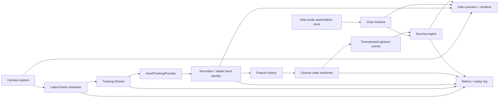

# 空間ジェスチャー音楽ゲーム 技術戦略・実装計画

- 更新日: 2026-07-19
- 文書種別: 技術選定 / アーキテクチャ / 検証計画
- ステータス: v0.2（オンボーディングレビュー反映版）
- 対象: PC内蔵・外付けWebカメラ、スマートフォンのインカメ

長期的なゲーム内容は`01_game_design_policy.md`、現行POC / MVPの範囲は`03_mvp_definition_and_roadmap.md`、POCゲートの実施は`05_poc_test_protocol.md`、MVP採点は`06_mvp_chart_scoring_spec.md`を正本とする。本書の技術選定と実装順序はそれらを検証するために従属する。読む順序と現在地は`docs/README.md`を参照する。

## 1. 結論

当初の「MediaPipe Hand Landmarkerを使ったWeb/PWAプロトタイプ」という方向は維持する。ただし、ゲームデザインを両手中心へ更新した結果、技術方針は次のように修正する必要がある。

1. **片手追跡を標準にしない。** コアモードは最初から`numHands = 2`で計測・設計し、片手はLite／アクセシビリティモードとする。
2. **Webを最終解と決め打ちしない。** PWAで最速検証し、POC技術ゲートを満たさない場合にだけAndroid・iOSの小さなネイティブ比較を発動する。
3. **追跡バックエンドを交換可能にする。** ゲーム判定はMediaPipe、Apple Vision、将来のONNX/WebGPU等から独立させる。
4. **動的ジェスチャーを汎用分類モデルへ丸投げしない。** ランドマークから得た幾何・速度・時系列を、明示的な状態機械で判定する。
5. **単眼カメラで厳密な3D位置を要求しない。** 画面座標、手の見かけの大きさ、相対距離、動きの履歴を使う2.5Dを正式な設計前提にする。
6. **音声クロックをゲーム時間の正本にする。** カメラフレーム到着時刻ではなく、推定したジェスチャー成立時刻を音声タイムラインと比較する。
7. **現行MVPはカジュアルに限定する。** 低スペック端末へは適応する。競技モードは任意研究とし、将来承認された場合だけ品質認証と固定プロファイルを要求する。
8. **全身追跡と人物セグメンテーションは初期コアから外す。** 必要になった場合だけ低頻度の姿勢推定や演出用機能として追加する。

この方針により、低〜中スペック端末への広い到達性を保ちつつ、上級者が求める判定の一貫性を別の品質ゲートで守る。

## 2. 当初案からの変更点

| 論点 | 当初案 | 再評価後 | 変更理由 |
|---|---|---|---|
| 追跡対象 | 片手を標準、必要時に二手 | 二手を標準、片手を明示モード | ハイタッチ、Crush & Burst、両手ポータル、小動作から大動作への身体的フレージングが本作の4本柱になった |
| 配信形態 | TypeScript PWAを中心に進める | PWAで検証し、技術ゲートが発動した場合だけAndroid/iOSを比較 | カメラ遅延・GPU利用・熱制御はブラウザだけで保証できないが、比較実装自体もスコープとして管理する |
| ジェスチャー認識 | Landmarker＋必要なら認識モデル | Landmarker＋時系列状態機械を第一選択 | 本作の動作は静的な手形でなく、接近・通過・開閉の時間構造が中心 |
| 3D | world landmarksも活用 | 2.5Dを正式前提とする | 単眼の奥行きは絶対的なカメラ空間座標ではない |
| カメラFPS | 60fpsを優先 | 30/60fpsを端末ごとに実測選択 | 60fps指定が実FPSや遅延改善を保証せず、熱・電力・露出へ悪影響もあり得る |
| 品質適応 | 推論頻度を動的変更 | カジュアルは適応、競技は曲開始前に固定 | 途中変更は判定の公平性と再現性を壊す |
| 全身・背景 | 将来拡張として比較的近い候補 | 初期コアから除外 | 手のゲーム価値を検証する前に計算量と故障点を増やさない |
| エンジン | Web中心、必要ならゲームエンジン | 軽量Webスタックを先行、Unity等は演出要件が確定後 | まずカメラ・判定・音声の不確実性を潰す方が重要 |

## 3. プレイヤー経験レベルから見た技術要件

プレイヤー像は仕様を正当化するための想像上の人物ではなく、テストで反証可能な仮説として扱う。

### 3.1 初心者・音楽ゲーム未経験者

重視するもの:

- カメラを許可した直後に手が反応すること
- どちらの手でも大きなターゲットへ触れられること
- ミスが自分の操作か機械の誤認か、感覚的に理解できること
- 長い設定や専門的なキャリブレーションを要求されないこと
- クラップが日常動作や顔の前の手振りで誤爆しないこと

技術への反映:

- 初回導入は15秒程度以内を目標にし、遊びながら手の大きさと可動域を測る。
- Easyは左右を固定しない`either`指定を使えるようにする。
- 入力候補を早めに可視化し、「認識はしているがタイミングが違う」と「手を見失った」を別表示にする。
- 初回は追跡負荷より読みやすさを優先し、ターゲットを大きくする。

### 3.2 中級者・一般的な音楽ゲーム経験者

重視するもの:

- 入力記号とジェスチャーの意味が曲を跨いで一貫すること
- タップ、スワイプ、レールの遷移が滑らかであること
- 成功・失敗の境界が学習可能であること
- 演出が判定の視認性を邪魔しないこと

技術への反映:

- ジェスチャーごとに独立した閾値を場当たり的に増やさず、共通特徴量と状態遷移を定義する。
- 追跡信頼度、ジェスチャー信頼度、タイミング誤差を分離する。
- 記録されたランドマーク列を再生できるテストハーネスを作り、版が変わっても同じ入力の結果を比較する。

### 3.3 上級者

重視するもの:

- 両手が独立した高速パターンでもIDが安定すること
- 同じ動作が同じオフセットで判定されること
- 演出の補間や予測が採点を歪めないこと
- ミス後も入力遅延や補正のせいだと感じにくいこと

技術への反映:

- 表示用座標と採点用座標を分離する。表示だけ短い予測を許し、採点はタイムスタンプ付きの未予測履歴から算出する。
- 左右の手が交差した時は、handednessだけでなく予測位置を使ってIDを割り当てる。
- 対称ジェスチャーは「左ID・右ID」ではなく順序のない二手集合として判定し、不要なID入れ替わり影響を消す。
- 判定オフセット分布をリザルトに表示できるようにする。

### 3.4 競技・スコアアタック層

重視するもの:

- 端末や曲中の負荷によって判定が変化しないこと
- 入力遅延と判定窓が明示・校正されていること
- 同じ条件でリプレイと再現ができること
- 低品質なカメラが有利にも不利にもならないこと

技術への反映:

- ランク対象は品質認証済みプロファイルだけにする。
- 曲開始時にカメラFPS、推論頻度、モデル、判定窓、補正値を固定する。
- 曲中に基準を維持できなければ、ランを「アシスト／非ランク」として明示するか、安全に中断する。
- 30fpsと60fps、Webとネイティブで同一ランキングを保証しない。実測で同等性が確認できない場合はプロファイル別ランキングにする。
- フレーム落ちを利用した有利な時刻補間が起きないよう、元フレーム時刻と推定方法を記録する。

### 3.5 アクセシビリティを必要とするプレイヤー

重視するもの:

- 片手、座位、狭い可動域でも楽曲を完走できること
- マイク許可や実際のクラップを強制されないこと
- 利き手、左右反転、身体サイズで不利にならないこと

技術への反映:

- `handPolicy`、`reachScale`、`seated`、`silentClap`を譜面とランタイムの正式な概念にする。
- 片手モードは両手譜面を雑に半減させず、代替ジェスチャーを譜面側に持つ。
- 絶対ピクセル距離ではなく、手幅・キャリブレーション範囲に正規化する。

## 4. 技術者の視点による再評価

### 4.1 コンピュータビジョン / ML

MediaPipe Hand Landmarkerは、21点の手ランドマーク、handedness、画像座標とworld landmarksを返し、動画モードでは追跡が成立している間のパーム検出を省略する。低〜中スペックを含む初期候補として現在も最も実用的である。

ただし、公式のPixel 6ベンチマーク値（平均でCPU約17.12ms、GPU約12.27ms）は、こちらの二手・ブラウザ・描画同時実行条件を保証しない。製品判断には二手を映し続けた状態でのp50/p95実測が必要である。

MediaPipe Gesture Recognizerは定型ジェスチャーには便利だが、本作の主要入力は「手形」より「時間変化」である。さらに公式カスタマイズ手順が依存するMediaPipe Model Makerは2026-06-05時点で非推奨・非アクティブ保守と明記されている。したがって初期コアは、学習済み汎用分類器ではなくランドマーク時系列＋状態機械とする。

### 4.2 Webパフォーマンス

Web版のHand Landmarkerの`detectForVideo()`は同期処理で、メインスレッドをブロックする。推論を専用Workerへ隔離し、古いフレームを絶対にキューへ溜めない。

`requestVideoFrameCallback()`はBaseline 2024となり、描画可能な新しいビデオフレームに合わせやすい。一方、`MediaStreamTrackProcessor`は利用可能範囲と実行コンテキストに差があるため、機能検出した高速経路に留める。

MediaPipe WebのVision TasksはWebGLが現実的な基盤で、WebGPU対応を前提にしない。ONNX Runtime WebのWebGPUやWebNNは将来の比較候補だが、現時点の全対象ブラウザ向け基準にはしない。

### 4.3 オーディオ / リズムゲーム

音楽ゲームでは、画面描画やカメラより音声タイムラインが安定した時間軸になる。`AudioContext({ latencyHint: "interactive" })`を使い、楽曲を`currentTime`上で先行スケジュールする。

`getOutputTimestamp()`で音声コンテキスト時間と`performanceTime`の対応を取り、利用可能なら`outputLatency`と`baseLatency`も記録する。ただしAPI値だけで人が聞く最終遅延を完全に表せるとは限らないため、ユーザー校正と外部計測を併用する。

Bluetooth音声は大きく変動する可能性がある。競技モードでは有線・本体スピーカーを推奨し、測定不能または過大な遅延の出力経路は非ランク扱いを検討する。

### 4.4 Android / iOS

ブラウザでの到達性は高いが、カメラパイプライン、GPU delegate、熱制御、フレームタイムスタンプの細かな制御はネイティブが有利になり得る。

- Android: CameraXの`STRATEGY_KEEP_ONLY_LATEST`で推論待ちの古いフレームを捨て、MediaPipe TasksまたはLiteRTのdelegateを比較する。
- iOS: AVFoundationの`alwaysDiscardsLateVideoFrames`を使い、MediaPipe TasksとApple Visionの手姿勢検出を同じ入力・端末で比較する。

ネイティブが必ず速いと決めつけず、同じ測定項目でWeb版と比較する。Webが基準を満たす端末では、配布と更新の容易さを優先してWebを継続してよい。

### 4.5 ゲームエンジン / レンダリング

初期はTypeScript、Vite、WebGL2またはCanvas、Web Audioの小さな構成が適切である。カメラ、推論、判定、音声の真のボトルネックを観察しやすい。

Unity、Godot等は悪い選択ではないが、最初の検証で必要な価値に対して、Webカメラ差異、ネイティブプラグイン、ビルドサイズ、デバッグ経路を増やす。3Dキャラクター制作、複雑なVFX、コンソール展開が製品要件になった段階で再評価する。

Three.jsやPixiJSも、最初のカーソル・ノーツ検証には必須でない。レンダラーを判定から分離しておけば、垂直スライス後に追加できる。

### 4.6 QA / テレメトリー

「ミスした」という結果だけでは、追跡、ジェスチャー、譜面理解、タイミングのどこが悪いか分からない。各段階の時刻と信頼度を記録し、派生ランドマーク列を同じ判定エンジンへ再投入できるようにする。

生映像はデフォルトで保存・送信しない。デバッグ収録は明示的な同意を得たローカル記録とし、共有時に再確認する。

### 4.7 人間工学 / アクセシビリティ

認識精度が高くても、腕を上げ続ける譜面は成立しない。技術側で`motionCost`を譜面スキーマに持ち、リンターが高所動作、長い保持、大動作の連続、回復不足を警告する。

可動域の個人差を難易度へ混入させない。スコアは正規化座標と相対動作を中心にし、腕の長さや絶対速度を直接評価しない。

### 4.8 プライバシー / セキュリティ

- カメラとマイクは別々の権限・目的として説明する。
- コアプレイはオンデバイス処理で完結させる。
- 生映像・生音声をサーバーへ送らないことをデフォルトにする。
- テレメトリーはフレーム画像でなく、処理時間、欠落、イベント、匿名化した端末能力を中心にする。
- モデル、WASM、JSパッケージは検証済みバージョンを固定し、自前配信とキャッシュを行う。

## 5. 採用技術と保留技術

| 技術 | 判断 | 用途 / 理由 |
|---|---|---|
| MediaPipe Hand Landmarker | 採用 | 二手21点ランドマークの第一バックエンド |
| MediaPipe Gesture Recognizer | コア不採用 | 静的手形の補助には使えるが、動的入力の中心にはしない |
| 自前の時系列状態機械 | 採用 | タップ、スワイプ、クラップ、開閉、レールを説明可能に判定 |
| MediaPipe Pose Landmarker | 条件付き | 初回の肩位置・座位・フレーミングを低頻度で測る場合のみ |
| MediaPipe Holistic Landmarker | 初期不採用 | 543ランドマークは本作初期の手中心入力に過剰で、公式にも更新予告がある |
| 人物セグメンテーション | 初期不採用 | Selfie Segmenterの公式Pixel 6値は約33〜35msで、コア遅延予算に重い |
| TypeScript + Vite PWA | 採用 | 最短でPC・スマホへ配布し、実機母数を増やす |
| Dedicated Worker | 採用 | 同期推論を描画・入力UIから隔離 |
| WebGL2 / Canvas overlay | 採用 | カメラ映像を直接表示し、必要なUIだけ重ねる |
| Web Audio API | 採用 | 音声クロック、先行スケジュール、遅延計測 |
| ONNX Runtime Web + WebGPU | R&D候補 | Chromium高速経路として将来比較するが、初期標準にしない |
| WebNN | 将来候補 | 標準と実装の成熟後に再評価 |
| Android CameraX + MediaPipe/LiteRT | 比較実装 | Webが品質ゲートを満たさない端末のネイティブ経路 |
| iOS AVFoundation + MediaPipe/Apple Vision | 比較実装 | iOSのネイティブ経路を同一条件で比較 |
| Unity / Godot | 保留 | 体験成立後、3D制作・配信要件で再評価 |

## 6. 全体アーキテクチャ



境界の原則:

- `HandTrackingProvider`より下流は、MediaPipe固有のAPIを知らない。
- 採点は描画フレームレートに依存しない。
- レンダラーは採点結果を変更しない。
- テレメトリーは全段階を観測するが、生映像を前提にしない。

## 7. 追跡データモデル

バックエンド共通の最小インターフェースを定義する。

```ts
type HandTrackingFrame = {
  frameId: number;
  captureTimeMs: number;
  receivedTimeMs: number;
  hands: Array<{
    trackId: string;
    handedness: "left" | "right" | "unknown";
    handednessScore: number;
    landmarks2D: Array<{ x: number; y: number; zRelative: number }>;
    landmarksWorld?: Array<{ x: number; y: number; z: number }>;
    trackingConfidence: number;
  }>;
};
```

### 7.1 座標の扱い

- ミラー変換は入力境界で一度だけ行い、ゲーム内の「画面左」と解剖学的な「左手」を混同しない。
- 画像座標X/Yを主要位置として使う。
- MediaPipeのZやworld landmarksは、手の相対形状・前後変化の補助に使う。
- world landmarksの原点はカメラ座標系の絶対位置ではないため、メートル単位の接触面を作らない。
- 距離・速度は手幅、初回可動域、画面寸法で正規化する。

### 7.2 派生特徴量

- 手のひら中心: 手首とMCP群からロバストに算出
- 手幅・見かけのスケール
- 開き具合: 指先と関節の相対距離・角度
- 手のひら向きの近似
- 位置速度・加速度
- 指先速度・ターゲット面との交差時刻
- 両手中心間距離とその一次・二次変化
- 両手の対称性、接近方向、相対速度
- 追跡信頼度と欠落継続時間

微分値はノイズを増幅するため、固定フレーム数ではなく実タイムスタンプに基づいて求める。

### 7.3 二手のID維持

二手しかないため、複雑な多人数追跡器は不要である。前フレームからの予測中心、handedness、手の見かけサイズを使い、2通りの割り当てコストを比較する。

- 通常時: 予測位置＋handednessで安定IDを付ける。
- 交差時: 位置連続性を優先し、handednessの一時反転を許容する。
- 対称入力: ID順序を使わず、二手集合として扱う。
- 短い遮蔽: 100〜150ms程度のジェスチャー別grace期間を仮置きする。
- 長い遮蔽: 推測で成功扱いにせず、追跡喪失を明示する。

## 8. ジェスチャー判定エンジン

### 8.1 状態機械を使う理由

動的入力には、「待機 → 候補 → コミット → クールダウン」という因果関係がある。これを明示すると、誤爆の理由を説明でき、録画データなしでも合成軌跡でテストできる。

各ジェスチャーは最低限、以下を返す。

- `eventTimeMs`: 成立したと推定する時刻
- `gestureType`
- `handIds`
- `confidence`
- `quality`: 方向、軌跡、保持など
- `trackingQuality`
- `reasonCodes`: 成功・拒否理由

### 8.2 ジェスチャー競合の調停

同じ動きがスワイプとタップ、クラップとツインヒットの両方に見えることがある。譜面コンテキストだけで強制成功させず、`GestureArbiter`で候補を比較する。

- 譜面は期待ジェスチャーの事前確率を上げるが、物理的に不成立な入力は通さない。
- 一つの動作から複数ノーツを誤発火しないよう、消費範囲とクールダウンを設ける。
- アクセシビリティ代替は、通常ジェスチャーと同じイベント型へ正規化する。

### 8.3 クラップの判定

クラップは二手遮蔽が必ず起こり得るため、「両手が同じピクセルになったフレーム」を要求しない。

1. 両手が開いている。
2. 手のひらが互いに向かう、または許容可能な向きにある。
3. 両手中心距離が継続的に減少する。
4. 相対速度が閾値を超える。
5. 距離と相対速度から接触予定時刻を外挿する。
6. 接触直前の遮蔽・追跡欠落を短時間だけ許容する。
7. 直後の反発・開放があれば信頼度を上げる。

マイクの短いトランジェントは、ユーザーが許可した場合のみ信頼度の補助に使う。音声到着時刻には入力・OS処理遅延があり、周囲の音でも発火するため、採点時刻の正本にはしない。音量は評価しない。

### 8.4 表示と採点の分離

- 表示: 視覚上の追従遅れを減らすため、短いα-β予測や速度外挿を許可する。予測は1フレーム程度、上限約20〜25msから検証する。
- 採点: 元のタイムスタンプ付き軌跡から、ターゲット面との交差時刻や距離最小時刻を補間する。
- UI予測位置がターゲットへ触れただけでは成功にしない。

## 9. カメラ取得とフレーム処理

### 9.1 初期設定

- 解像度: 640×480を基準に実測する。
- 向き: 横長を基本とするが、スマートフォン縦持ちもレイアウト層で対応可能にする。
- FPS: 60を`ideal`候補、30を必須フォールバックとし、実FPSを測る。
- プレビュー: `<video>`を直接表示し、毎フレームCanvasへコピーしない。
- 推論: 専用Worker、常に最新1フレームのみ。

二手が画面内で小さくなる端末では、解像度を下げすぎると指先精度を失う。逆に高解像度化で推論時間が増えるかはモデル入力リサイズの実装にもよるため、640×480、960×540、1280×720を測定し、画質ではなくイベント精度とフレーム年齢で選ぶ。

### 9.2 Webの取得経路

優先順:

1. 対応環境: `MediaStreamTrackProcessor`からWorkerへ`VideoFrame`を渡す。
2. 標準経路: `requestVideoFrameCallback()`で新規フレームを検知し、転送可能な`ImageBitmap`等をWorkerへ渡す。
3. 最終フォールバック: 低頻度の明示的取り込み。

どの経路でも:

- 推論中に新しいフレームが来たら、待ち行列を増やさず次回用の最新参照だけ更新する。
- 古い`VideoFrame`、`ImageBitmap`は必ず`close()`する。
- `captureTime`等が得られる場合は保存し、得られない場合も提示時刻と受信時刻を区別する。
- 機能検出で分岐し、ユーザーエージェント文字列で決め打ちしない。

### 9.3 30fpsと60fps

30fpsではフレーム量子化だけで最大約33.3ms、平均的には半分程度の時刻不確実性が生まれる。60fpsはこれを改善し得るが、カメラ内部バッファや露出時間、ブラウザの処理、推論速度が支配する場合は効果が小さい。

したがって、FPSラベルではなく次を比較する。

- 実際のフレーム間隔
- キャプチャからWorker受信までの年齢
- 推論完了時のフレーム年齢
- イベント時刻誤差
- 熱による5分後・15分後の劣化
- 暗所でのブレと追跡欠落

## 10. 音声クロックと採点時刻

### 10.1 時間軸

楽曲開始時に`AudioContext.currentTime`上の将来時刻へ再生を予約し、その時刻を譜面のbeat 0とする。BPM変更を含む譜面時刻は、一つのタイムライン変換関数に集約する。

```text
chart beat
  -> audio context time
  -> performance time（getOutputTimestampで対応）
  -> gesture eventTimeとの差
  -> judgement
```

### 10.2 オフセット

別々に扱うべき値:

- 出力音声の遅延
- 映像表示の遅延
- カメラ取得・推論の遅延
- ジェスチャー種類ごとの成立点
- プレイヤー個人の知覚・運動オフセット

全てを一つの「謎の補正値」へ混ぜない。自動測定値、端末プロファイル、ユーザー校正を分離して保存する。

### 10.3 初期判定窓の仮説

実測前のプレイテスト出発点としてのみ、以下を候補にする。

| プロファイル | Perfect | Great | Good | 備考 |
|---|---:|---:|---:|---|
| Casual | ±70ms | ±110ms | ±150ms | 30fpsを含む幅広い端末。快適性優先 |
| Ranked候補 | ±45ms | ±80ms | ±120ms | 認証済み高品質プロファイルのみ |

これは製品仕様ではない。外部計測したイベント時刻誤差と、複数経験層のオフセット分布から改定する。クラップ、レール、ポーズは同じ判定式にせず、「音楽上の成立時刻」と継続品質を分ける。

## 11. 品質プロファイルと低スペック対応

### 11.1 ランタイム品質階層

| 層 | 目安 | 運用 |
|---|---|---|
| A / Certified | 二手追跡45Hz以上を安定、低いフレーム年齢 | Ranked候補、固定設定 |
| B / Standard | 二手追跡25〜44Hz | Casual標準、通常譜面 |
| C / Lite | 二手15〜24Hzまたは不安定 | 片手譜面、低密度、演出軽減 |
| Unsupported | 安定した手追跡が成立しない | 環境改善案を提示し、無理に開始しない |

Hzだけで層を決めない。フレーム年齢、欠落、イベント時刻誤差を併用する。

### 11.2 負荷を下げる順序

1. パーティクル、ポストエフェクト、背景演出を減らす。
2. アバター品質とUI解像度を下げる。
3. 姿勢推定など補助処理を停止する。
4. 推論入力・取得設定を検証済み低負荷プロファイルへ切り替える。
5. 片手Lite譜面へ切り替える。

採点の根幹である音声タイムラインとイベント算出を最後まで守る。曲中の設定変更はCasualの視覚品質に限り、Rankedの推論・判定設定は変えない。

### 11.3 暫定品質ゲート

ゲートの実施方法と記録は`05_poc_test_protocol.md`を正本とする。数値は製品保証ではなく、次フェーズへ進む判断基準である。

**P1-Controlled / P2-Interaction — 少人数POC学習ゲート**

- 各ジェスチャー8/10以上を出発点とする。
- false trigger 90秒に1回以下。
- machine miss 90秒に2回以下。
- 両テスターの同期感4/5以上。
- 同じ条件の3回目まで品質が悪化しない。

これは2人で状態機械と操作感を学ぶためのゲートであり、配布品質を保証しない。

**M1-Web MVP — 広いMVPテストへの継続条件**

- 明るい標準環境で二手カバレッジ95%以上
- 二手追跡出力25Hz以上
- 推論完了時のフレーム年齢p95が140ms以下
- 主要ジェスチャーのcontrolled recall 95%以上
- 誤発火が10分に1回未満
- 1曲中にメモリ・フレーム待ち行列が増加しない

**R1-Ranked — 任意研究の候補条件**

- 認証対象端末で二手追跡45Hz以上を継続
- motion-to-event p95が90ms以下
- イベント時刻誤差のばらつきがp95で25ms以下
- 交差を含まない通常譜面で重大なID swapが実質的に発生しない
- 15分の熱試験後も品質階層を維持
- 外部240fps計測とリプレイで結果を再現できる

R1は競技モードが製品方針として承認された場合だけ使用する。満たさない場合もMVPを失敗とみなさず、Casualの品質判断とは分離する。

## 12. Web実装スタック

### 12.1 初期推奨

- TypeScript
- Vite
- `@mediapipe/tasks-vision`の検証済み固定バージョン
- Dedicated Worker
- Canvas 2DまたはWebGL2の軽量オーバーレイ
- Web Audio API
- JSON譜面＋JSON Schema
- Vitest等による純粋ロジックテスト
- Playwright等による対応ブラウザの起動・権限・描画確認（カメラ品質そのものは実機試験）

### 12.2 配布

- パッケージ、WASM、モデルを`@latest` CDN参照にしない。
- 同じオリジンから検証済みアセットを配信し、Service Workerでキャッシュする。
- モデルと譜面にバージョン・ハッシュを持たせる。
- MediaPipe SolutionsがPreview表記であることを前提に、アップデートは自動追従せず回帰試験後に行う。
- `SharedArrayBuffer`やWASMスレッドが実測で必要な場合のみCOOP/COEPを導入する。導入すると外部アセットや埋め込みへ制約が出るため、先に使わない。

### 12.3 レンダリング

- カメラ映像は`<video>`を直接背面に表示する。
- オーバーレイ座標変換を一箇所に集約する。
- 描画は`requestAnimationFrame()`、追跡はカメラフレーム駆動とし、互いを待たせない。
- ノーツ移動はフレーム加算でなく音声時刻から毎回算出する。
- 3Dアバターや高度なVFXは、測定オーバーレイを消さずに追加できる別層とする。

## 13. 譜面・ジェスチャー定義

譜面はbeat基準とし、入力の意味、代替、身体負荷をデータで表す。

```json
{
  "beat": 64,
  "gesture": "clap",
  "targets": ["both"],
  "handPolicy": "two-required",
  "previewBeats": 4,
  "timingWindow": "burst-default",
  "motionCost": {
    "shoulder": 1,
    "wrist": 1,
    "macro": 4
  },
  "fallback": {
    "oneHand": "air-smash",
    "silentClap": "near-clap"
  },
  "soundStem": "chorus-impact"
}
```

### 13.1 必須フィールドの考え方

- `beat`: 楽曲上の位置
- `gesture`: 共通ジェスチャーID
- `targets`: 空間ゾーンまたは対象
- `handPolicy`: left / right / either / two-required / unordered-two
- `previewBeats`: 身体準備に必要な予告量
- `timingWindow`: ジェスチャー種別に対応した判定定義
- `motionCost`: 累積負荷リンター用
- `fallback`: 片手、座位、無音等の代替
- `soundStem`: 入力成功時に変化させる音楽レイヤー

### 13.2 譜面リンター

最低限、以下を自動検査する。

- 高い位置の連続
- 大動作間隔が短すぎる
- 静的保持が長すぎる
- 片手レール中に同じ手へ別ノーツが来る
- 物理的に不可能または危険な遷移
- 手の交差直後に厳密な左右指定がある
- アクセシビリティ代替が欠けている
- 予告時間が動作サイズに対して短い
- 小節単位の累積`motionCost`超過

## 14. 測定とテスト

### 14.1 常時計測する技術指標

**入力・追跡**

- 手の初回取得時間
- 二手カバレッジ
- 片手ごとの欠落率・連続欠落時間
- ID swap回数
- 追跡信頼度分布
- ジェスチャーごとのprecision / recall
- 1時間あたりの誤発火

**遅延・性能**

- キャプチャ→メイン/Worker到着
- Worker待機時間
- 推論p50 / p95 / max
- 推論完了時のフレーム年齢
- ジェスチャーイベント算出時間
- motion-to-event
- motion-to-photon
- `baseLatency` / `outputLatency`
- 実カメラFPS、追跡出力Hz、描画FPS
- メモリ、温度劣化、バッテリー消費

**ゲームプレイ**

- 判定オフセット分布
- 手・ジェスチャー別のミス
- 読み違い、身体不成立、追跡喪失の内訳
- 完走率、リトライ率
- 曲後のBorg CR10等による局所疲労
- NASA-TLX等による認知負荷
- 痛み、不快感、酔い、目の疲れ

### 14.2 リプレイハーネス

タイムスタンプ付きの派生ランドマーク、追跡信頼度、譜面・モデル・設定バージョンをローカル保存できるようにする。

- 同じ記録を新旧判定エンジンへ入力し、イベント差分を比較する。
- 合成軌跡で境界値、欠落、交差、FPS変動を再現する。
- 実映像は原則不要にし、必要な失敗だけ明示同意で収録する。
- ベンチマーク記録は初心者から上級者、肌の見え方、背景、照度、端末を偏らせない。

### 14.3 外部遅延計測

240fps以上の外部カメラで、次を同じ画角に撮る。

- プレイヤーの手
- 画面上の反応
- 音に同期したLEDまたは測定用視覚信号

必要に応じてオーディオ出力を波形として同時収録し、手の物理イベント、ゲームイベント、描画、音声の差をフレーム単位で測る。平均だけでなくp95と経時劣化を見る。

### 14.4 実機マトリクス

最低限:

- 低価格Windowsノート内蔵カメラ
- 中級Windows PC＋一般的なUSB Webカメラ
- 高性能PC＋60fpsカメラ
- 低〜中級Android
- 高級Android
- 数世代のiPhone
- 明所、一般室内、暗め、逆光、複雑背景
- 本体スピーカー、有線音声、Bluetooth

「高性能端末で動いた」ことを低スペック対応の証拠にしない。反対に、最も悪い1端末のために全体の表現を落とさず、Lite経路を設ける。

## 15. プレイヤーテスト計画

各フェーズで少人数を繰り返し、最終段階だけ大人数にしない。

| グループ | 主な確認 |
|---|---|
| 未経験・初心者 | 導入、記号理解、誤発火への反応、疲労 |
| 中級者 | フロー、譜面文法、上達感、両手遷移 |
| 上級者 | 判定一貫性、ID安定、複合リズム、リプレイ納得度 |
| 競技層（任意研究） | 競技モードが承認された場合のみ、校正、狭い判定窓、端末差、ランキング条件 |
| アクセシビリティ協力者 | 片手、座位、可動域、無音、左右反転 |

観察時はスコアだけでなく、次を聞き分ける。

- 「何をすべきか分からなかった」
- 「分かったが身体が間に合わなかった」
- 「やったが認識されなかった」
- 「認識されたが音と合って感じなかった」

この4種を混ぜると、UI、譜面、CV、タイミングのどこを直すべきか誤る。

## 16. 技術ワークストリーム

プロダクト全体のゲート式ロードマップは`03_mvp_definition_and_roadmap.md`を正本とする。以下は技術作業の依存順を示すワークストリームであり、同名のプロダクトフェーズや暦上の期間を表さない。

### Technical Stage T0 — Measurement Lab

ゲームを作り込む前に、測るための最小アプリを作る。

実装:

- 二手カーソルと21点表示
- エアタップ、リボンスワイプ、Crush & Burst（クラップ／ニアクラップと両手開放を含む）
- Web Audioのメトロノームと時刻表示
- 30/60fps、解像度、CPU/GPU経路の比較
- 全テレメトリーとローカルリプレイ
- 追跡なしのマウス／記録再生入力

出口:

- 主要端末で二手の実測表が得られる。
- 各ジェスチャーの成立点と主な失敗が説明できる。
- フレームキューが溜まらない。

### Technical Stage T1 — 1曲のWeb垂直スライス

実装:

- Pulse / Flow / Burstを含む約90秒の1曲
- Easyのみ
- エアタップ、リボンスワイプ、Crush & Burst
- キャラクターなしのSFホログラム空間
- 自動品質診断（Lite自動切り替えはMVP後）

この段階はCasual扱いとし、ランキングを約束しない。

出口:

- ターゲットテスターが、Crush & Burstまたはリボンスワイプを印象的な瞬間として自発的に挙げる。
- iPhone 15とGoogle Pixel 10 Pro XLの両方で、現行POCの技術ゲートを満たす。
- 技術的失敗と譜面上の失敗をログで区別できる。

### Technical Gate T-A — Web継続判断

- P1/P2を満たす: Webで90秒MVPを継続する。
- 一方のOSだけ満たさない: 対応端末の限定またはTechnical Stage T2を発動する。
- 両OSで遅延が不快: 画角、照明誘導、動作文法、時刻処理を見直した後、Technical Stage T2を発動する。
- 技術は満たすが体験が弱い: ネイティブ化せず、譜面、効果音、予告、ジェスチャー構成を変更する。

### Technical Stage T2 — ネイティブ比較スパイク（条件付き）

発動条件: Technical Gate T-Aで、Web固有の遅延・熱・カメラ経路が主要な阻害要因と判断された場合。

垂直スライス全体を移植せず、同一の計測画面とジェスチャー記録だけを作る。

- Android: CameraX＋MediaPipe GPU/LiteRT候補
- iOS: AVFoundation＋MediaPipe、Apple Vision比較
- 共通テスト記録と共通イベント定義

比較:

- 二手追跡Hz
- p95フレーム年齢
- motion-to-event
- 熱・電力
- 端末カバレッジ
- 実装・保守コスト

出口:

- Webのまま進む、初期対応OSを限定する、ネイティブを主要経路にする、のいずれかを実測で決める。

### Technical Stage T3 — タイミング・競技性ラボ（任意研究）

発動条件: Phase 4以降に、競技モードを製品方針として明示的に承認した場合。現行MVPの完了条件ではない。

- 外部240fps計測
- 自動＋手動オフセット校正
- 固定品質プロファイル
- リザルトのオフセット分布
- Hard譜面の両手独立パターン
- リプレイ検証と不正・異常フレーム検出の基礎

出口:

- R1-Ranked候補ゲートを満たす端末群が定義できる。
- 判定窓をプレイヤーデータから決められる。
- Web同士、Webとネイティブを同一ランキングにできるか判断できる。

### Technical Stage T4 — 譜面制作基盤

- JSON Schema
- タイムラインエディタ
- 身体負荷リンター
- 片手・座位代替のプレビュー
- ランドマークリプレイ上での譜面検証
- 音源stemと成功演出の編集

### Technical Stage T5 — 製品化

- モデル・アセットの固定配信と更新手順
- 端末能力データベースと品質認証
- プライバシー説明、同意、データ削除
- 長時間・復帰・権限拒否・カメラ切替試験
- アクセシビリティ監査
- 競技モードが承認された場合のみ、ランキングのプロファイル分離または同等性証明

## 17. 主要リスクと対策

| リスク | 兆候 | 対策 |
|---|---|---|
| 二手で推論Hzが落ちる | p95推論とフレーム年齢が急増 | Worker、latest-only、演出削減、画角・入力設定を見直し、Technical Gate T-Aが発動した場合だけネイティブ比較 |
| クラップで遮蔽・ID swap | 接触直前に手が消える | 相対軌跡から接触時刻予測、短いgrace、順序なし二手判定 |
| カメラ30fpsの時刻不確実性 | 高速曲でオフセットが離散化 | 軌跡補間、広いCasual窓、60fps認証、プロファイル別競技 |
| 暗所・逆光・動体ブレ | 欠落と誤位置が増える | 開始前診断、照明ガイド、ターゲット拡大、非ランク化 |
| 追跡表示が遅く感じる | 手とカーソルがずれる | 表示のみ短時間予測、カメラ直表示、描画負荷削減 |
| 予測が採点を甘くする | 高速動作で先行判定 | 採点は元タイムスタンプ軌跡、予測は表示限定 |
| Bluetooth音声遅延 | 音と判定が大きくずれる | 校正、警告、競技出力制限、プロファイル保存 |
| モデル更新で判定が変わる | 同じリプレイ結果が変化 | バージョン固定、回帰コーパス、段階的ロールアウト |
| 身体疲労 | 後半のスコア・満足度低下 | motionCost、リンター、マクロ間隔、回復、プレイヤー調査 |
| Web API断片化 | 特定ブラウザだけ動かない | 機能検出、複数取得経路、サポート表、ネイティブ退避 |
| 生体映像への不安 | 権限拒否・離脱 | オンデバイス、保存なしを明記、マイク任意、派生ログ中心 |

## 18. 最初に作るべきバックログ

優先度順:

1. `HandTrackingProvider`インターフェースとMediaPipe Web実装
2. latest-frame-only Workerパイプライン
3. 音声クロックとbeat変換
4. タイムスタンプ付き追跡メトリクス表示
5. 座標正規化、手幅、手のひら中心、安定ID
6. エアタップの状態機械
7. リボンスワイプの方向・中心通過・軌跡判定
8. クラップ予測とCrush & Burstの複合状態機械
9. ジェスチャー別の短い効果音バンクとWeb Audio再生
10. 派生ランドマークリプレイ
11. 1曲用の最小JSON譜面ローダー
12. 品質診断（Casual / Lite自動選択はMVP後）
13. 外部遅延計測用の画面・音声マーカー

この順序なら、華やかな演出を作る前に「二手が取れるか」「時刻が信頼できるか」「クラップが誤爆しないか」という最大の不確実性を減らせる。

MVP後に、ツインヒット、サウンドレール、両手ポータルを追加検証する。キャラクターとのハイタッチは、評価可能なキャラクター表現を用意できる段階まで保留し、仮キャラクターで感情価値を検証済みと扱わない。

## 19. 採用判断を再度開く条件

以下のいずれかが起きたら、技術選定を更新する。

- 二手MediaPipe Webが主要ターゲットの過半でCasual品質ゲートを満たさない。
- ネイティブ比較でmotion-to-eventまたは熱持続性が実用上大きく改善する。
- 主要ブラウザでWebGPUまたはWebNNが安定し、MediaPipe WebGL経路を明確に上回る。
- 動的状態機械が特定ジェスチャーで十分なprecision / recallを得られず、十分な失敗データが蓄積する。
- 3Dアバター・VFX・コンソール展開が製品の主要要件になり、軽量Webレンダラーの制作コストを上回る。
- プレイヤーテストで2.5Dの奥行き表現が本作の価値に不足すると判明する。

新しいMLモデルを検討する場合も、先に失敗データと評価指標を作る。モデルを導入すること自体を進歩とみなさない。

## 20. 参考資料

### MediaPipe / オンデバイス推論

- [MediaPipe Hand Landmarker — Google AI Edge](https://developers.google.com/edge/mediapipe/solutions/vision/hand_landmarker)
- [Hand Landmarker for Web — Google AI Edge](https://developers.google.com/edge/mediapipe/solutions/vision/hand_landmarker/web_js)
- [Hand Landmarker for iOS — Google AI Edge](https://developers.google.com/edge/mediapipe/solutions/vision/hand_landmarker/ios)
- [MediaPipe Gesture Recognizer — Google AI Edge](https://developers.google.com/edge/mediapipe/solutions/vision/gesture_recognizer)
- [Customize Gesture Recognizer / Model Maker status — Google AI Edge](https://developers.google.com/edge/mediapipe/solutions/customization/gesture_recognizer)
- [MediaPipe Pose Landmarker — Google AI Edge](https://developers.google.com/edge/mediapipe/solutions/vision/pose_landmarker)
- [MediaPipe Holistic Landmarker — Google AI Edge](https://developers.google.com/edge/mediapipe/solutions/vision/holistic_landmarker)
- [MediaPipe Image Segmenter performance — Google AI Edge](https://developers.google.com/edge/mediapipe/solutions/vision/image_segmenter)
- [LiteRT delegates — Google AI Edge](https://developers.google.com/edge/litert/performance/delegates)
- [MediaPipe WebGPU support issue](https://github.com/google-ai-edge/mediapipe/issues/5826)

### Webプラットフォーム

- [HTMLVideoElement.requestVideoFrameCallback() — MDN](https://developer.mozilla.org/en-US/docs/Web/API/HTMLVideoElement/requestVideoFrameCallback)
- [MediaStreamTrackProcessor — MDN](https://developer.mozilla.org/en-US/docs/Web/API/MediaStreamTrackProcessor)
- [ONNX Runtime Web — official documentation](https://onnxruntime.ai/docs/get-started/with-javascript/web.html)
- [Web Neural Network API — W3C](https://www.w3.org/TR/webnn/)

### オーディオ

- [Web Audio API 1.1 — W3C](https://www.w3.org/TR/webaudio-1.1/)
- [AudioContext.getOutputTimestamp() — MDN](https://developer.mozilla.org/en-US/docs/Web/API/AudioContext/getOutputTimestamp)
- [AudioContext.outputLatency — MDN](https://developer.mozilla.org/en-US/docs/Web/API/AudioContext/outputLatency)

### ネイティブカメラ

- [CameraX Image analysis — Android Developers](https://developer.android.com/media/camera/camerax/analyze)
- [AVCaptureVideoDataOutput.alwaysDiscardsLateVideoFrames — Apple Developer](https://developer.apple.com/documentation/avfoundation/avcapturevideodataoutput/alwaysdiscardslatevideoframes)
- [VNDetectHumanHandPoseRequest — Apple Developer](https://developer.apple.com/documentation/vision/vndetecthumanhandposerequest)

### 人間工学・プレイ負荷

- [Predicting Mid-Air Interaction Movements and Fatigue — CHI 2020](https://doi.org/10.1145/3313831.3376701)
- [Cumulative arm fatigue in mid-air interaction](https://vvise.iat.sfu.ca/pubs/jang2017fatigue)
- [WICE: Modeling Interaction Cost in Mid-Air — UIST 2025](https://doi.org/10.1145/3746059.3747745)
- [Difficulty, Cognitive Load, and Performance in VR Rhythm Games](https://arxiv.org/abs/2507.06691)

---

最終的な技術方針は「Webかネイティブか」から始めない。本作の価値である二手の空間演奏を、どの端末群で、どの遅延・精度・疲労・公平性まで提供するかを先に測り、その品質を満たす最も軽い実装を選ぶ。
