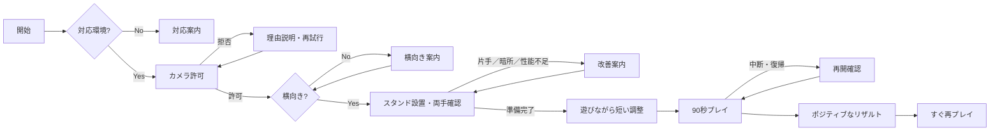

# 空間ジェスチャー音楽ゲーム MVP UI/UX方針

- 更新日: 2026-07-20
- 文書種別: POC / MVP向け画面・操作・フィードバック方針
- ステータス: v0.2（画面状態・例外フロー追加）

現行MVPのスコア計算とリザルト帯は[06_mvp_chart_scoring_spec.md](./06_mvp_chart_scoring_spec.md)、POCの追跡・誤認識分類は[05_poc_test_protocol.md](./05_poc_test_protocol.md)を正本とする。

## 1. 体験原則

1. **カメラを意識させすぎない。** 生映像は通常非表示とし、ゲーム世界へ集中させる。
2. **手が認識されている安心感を消さない。** 左右の手を光、輪郭、短い軌跡として常時返す。
3. **成功は明快、ミスは静かにする。** 不快な警告音や強い赤点滅で罰しない。
4. **演出は判定対象を隠さない。** 派手さは入力成立後に外側へ開き、次のノーツ領域を空ける。
5. **次の動作を形で読ませる。** 色だけでなく、面、帯、収束する手形、膨張する球で区別する。
6. **曲は最後まで続く。** 低スコアでも失敗画面へ送らない。

## 2. MVP画面フロー



設定画面を先に並べず、手を入れる、光が反応する、最初の音が鳴る、という順で導入する。

### 2.1 画面状態一覧

| 状態 | プレイヤーへ見せるもの | 主な行動 |
|---|---|---|
| unsupported | 対応外理由と、PC／別ブラウザ等の代替案 | 案内へ進む |
| permission-required | カメラを使う目的、生映像を送信・保存しない方針 | 許可する |
| permission-denied | 許可が必要な理由と端末設定からの戻り方 | 再試行する |
| audio-blocked | 音声開始に画面操作が必要であることを短く説明 | 「音を有効にする」を押す |
| orientation-required | 横向きの端末図と、スタンドへ置く案内 | 横向きにする |
| framing | 左右の手の光、快適領域、距離・照明の案内 | 両手を収める |
| ready | 両手の光が安定し、準備完了音が鳴る | プレイ開始 |
| playing | ノーツ、手の光、必要最小限の進行表示 | 演奏する |
| one-hand-lost | 消えた側の光と「手を少し内側へ」 | 手を戻す |
| both-hands-lost | 曲は続けつつ、中央に短いフレーミング案内 | 両手を戻す |
| performance-low | 照明、距離、他アプリ終了等の改善案 | 続ける／診断へ戻る |
| paused/resume | 音声とカメラを再同期してから再開する説明 | 再開／終了 |
| result | ポジティブ名称、捉えた拍、得意動作、再挑戦 | もう一度 |

Phase 1では最低限、`framing`、`ready`、`playing`、`one-hand-lost`、`both-hands-lost`、`performance-low`を実装する。権限拒否と復帰はPhase 3受け入れ前までに実装する。

## 3. 横画面の仮レイアウト

### 3.1 Phase 1計測作業モード

スマートフォン横向きのPhase 1では、最初の画面をカメラとP1-Controlled操作の二列へ固定する。カメラは4:3の取得画角を保ち、横長の枠へ`cover`して上下を切り落とさない。常時見せるのは追跡状態、開始／停止、試行進捗、現在の指示、手動分類、JSON保存だけとする。

全メトリクスは表示し続けなくてよい。追跡Hz、推論時間、frame age、coverage、queue状態等はバックグラウンドで収集してJSONへ保存し、画面上のLive diagnosticsは初期状態で折りたたむ。Developer overlay設定と詳細診断はトラブル調査時だけ開く。実機確認レポートはPC記入を主とし、スマートフォンの最初の画面へ入れない。

### 3.2 セットアップ

```text
┌────────────────────────────────────────────┐
│              スマホをスタンドへ             │
│                                            │
│       ○ 左手をここへ     右手をここへ ○     │
│                                            │
│       左手: 認識中        右手: 認識中      │
│                                            │
│        生カメラ映像は通常表示しない          │
│              [準備できた]                   │
└────────────────────────────────────────────┘
```

### 3.3 プレイ

```text
┌────────────────────────────────────────────┐
│ 曲進行                    小さなコンボ表示 │
│                                            │
│      次のノーツ／リボン／ハンドサイン      │
│                                            │
│  左手の光       Crushのエネルギー球  右手の光 │
│                                            │
│        手を置く快適範囲を薄く表示           │
│                                            │
│  左手状態                               右手状態 │
└────────────────────────────────────────────┘
```

- 中央をキャラクター用にはせず、ノーツと両手関係の演出へ使う。
- スコアとコンボは小さくし、手の位置と次の動作を優先する。
- 端末のノッチ、Dynamic Island、ブラウザUIを避ける安全領域を持つ。

### 3.4 リザルト

```text
┌────────────────────────────────────────────┐
│                Great Flow                  │
│                                            │
│     捉えた拍 42        ベストチェイン 16    │
│                                            │
│          得意な動作: リボンスワイプ          │
│     次は両手を少しだけ中央へ置いてみよう      │
│                                            │
│               [もう一度]                   │
└────────────────────────────────────────────┘
```

追跡品質不足時は得点帯を表示せず、`Let's Tune Your Setup`と一つの改善案を表示する。

### 3.5 15秒クリップの仮構成

1. 0〜3秒: 二つの手の光とエアタップで、カメラ操作であることを伝える。
2. 3〜7秒: 大きなリボンスワイプで動きと画面効果を一致させる。
3. 7〜12秒: 浮遊ハンドサイン、光球圧縮、クラップ／ニアクラップ、Burstを連続で見せる。
4. 12〜15秒: 外周へ広がる光とポジティブな短いリザルトを見せる。

## 4. セットアップとカメラ非表示

- 通常プレイでは生カメラ映像を表示しない。
- 開発モードだけ、生映像、21点ランドマーク、処理時間を表示する。
- ユーザー向けセットアップでは、左右の手に対応する二つの光だけを表示する。
- 両手が快適領域へ入ったら光が安定し、短い音で準備完了を伝える。
- 片手を見失った場合、MISSを出さず、該当側の光を薄くして「手を少し内側へ」と案内する。

## 5. ジェスチャーの視覚言語

### エアタップ

- 薄い面またはリングとして表示する。
- 指先が横切る瞬間に中心から短く発光する。
- 成功音は短く、音程感の少ない明瞭な打音にする。

### リボンスワイプ

- 帯の流れ、矢印、終点で方向を予告する。
- 成功後は切断面から粒子が進行方向へ流れる。
- 成功音は短い掃過音とし、エアタップと聞き分けられるようにする。

### Crush & Burst

- 左右から浮遊ハンドサインを出し、両手を中央へ導く。
- 両手の間に光球を生成し、距離に応じて圧縮する。
- クラップ／ニアクラップ成立後、次の拍で左右へ開く方向を予告する。
- 開放時は画面中央を白く潰さず、外周へ光と空間を広げる。
- 成功音は圧縮音、短いインパクト、開放音の三段階とする。

## 6. 判定フィードバック

- 成功: 光、短い音、軽いスケール変化を同時に返す。
- タイミングが近い: 演出量を少し抑えるが、否定的な文言を出さない。
- 不成立: ノーツを静かにほどき、次の入力を邪魔する警告音を出さない。
- 追跡喪失: 判定ミスと分離し、手位置の案内を出す。
- デバッグログでは、読み違い、タイミング、ジェスチャー不成立、追跡喪失を別に記録する。

## 7. ポジティブなリザルト案

低い結果を隠さず、失敗者として扱わない。

達成帯の数値境界とResonance算出は`06_mvp_chart_scoring_spec.md`を正本とする。

| 仮の達成帯 | ポジティブ名称 | 返す内容 |
|---|---|---|
| 高い | Full Resonance | 最も同期したフレーズ、ベストチェイン |
| 中高 | Great Flow | 滑らかだった動作、次に伸びるポイント |
| 中 | Nice Groove | 捉えた拍数、得意だったジェスチャー |
| 初回・低い | First Spark | 最初に成功した動作、すぐ再挑戦できる導線 |

リザルトの中心は総合点だけにせず、次を表示する。

- 捉えた拍数
- ベストチェイン
- 最も得意だったジェスチャー
- 印象的な成功場面の短い再生または静止画（MVP後候補）
- 改善案は一度に一つだけ
- 大きな「もう一度」ボタン

「失敗」「下手」「ランク外」等の否定的な表現は使わない。

## 8. POCのビジュアル範囲

- 暗い背景、シアン／マゼンタ系のホログラム色を仮置きする。
- フォント、ロゴ、世界観設定は固定しない。
- キャラクター、背景物語、衣装、ステージ制作は行わない。
- 配信映えは、Crush & Burstの15秒クリップで最低限検証する。

## 9. MVP後に検討するUX

- キャラクターの掛け声を拍とフレーズへ同期する。
- 掛け声は楽曲と競合しない短さ・音量・頻度にする。
- キャラクターとのハイタッチ、コール＆レスポンス、デュエットを追加する。
- 大型PC画面と立位プレイで、現実のプレイヤーと画面内キャラクターが一緒に踊って見える構図を作る。
- 縦動画用の自動リフレームと配信用HUDを検討する。
