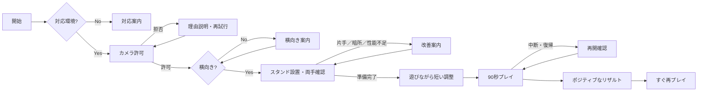

# 空間ジェスチャー音楽ゲーム MVP UI/UX方針

- 更新日: 2026-09-14
- 文書種別: POC / MVP向け画面・操作・フィードバック方針
- ステータス: v0.4（Phase 1を5動作・50試行へ拡張。ブロック進行、準備完了後の合図、中断と再開を追加。2026-09-14のコードレビュー後の修正を反映）

現行MVPのスコア計算とリザルト帯は[06_mvp_chart_scoring_spec.md](./06_mvp_chart_scoring_spec.md)、POCの追跡・誤認識分類は[05_poc_test_protocol.md](./05_poc_test_protocol.md)を正本とする。

## 1. 体験原則

1. **カメラを意識させすぎない。** 生映像は通常非表示とし、ゲーム世界へ集中させる。
2. **手が認識されている安心感を消さない。** 左右の手を光、輪郭、短い軌跡として常時返す。
3. **成功は明快、ミスは静かにする。** 不快な警告音や強い赤点滅で罰しない。
4. **演出は判定対象を隠さない。** 派手さは入力成立後に外側へ開き、次のノーツ領域を空ける。
5. **次の動作を形で読ませる。** 色だけでなく、面、帯、収束する手形、膨張する球で区別する。
6. **曲は最後まで続く。** 低スコアでも失敗画面へ送らない。

## 2. MVP画面フロー


```mermaid
flowchart LR
    A["開始"] --> S{"対応環境?"}
    S -- "No" --> U["対応案内"]
    S -- "Yes" --> B["カメラ許可"]
    B -- "拒否" --> X["理由説明・再試行"]
    X --> B
    B -- "許可" --> O{"横向き?"}
    O -- "No" --> L["横向き案内"]
    L --> O
    O -- "Yes" --> C["スタンド設置・両手確認"]
    C -- "片手／暗所／性能不足" --> H["改善案内"]
    H --> C
    C -- "準備完了" --> D["遊びながら短い調整"]
    D --> E["90秒プレイ"]
    E -- "中断・復帰" --> P["再開確認"]
    P --> E
    E --> F["ポジティブなリザルト"]
    F --> G["すぐ再プレイ"]
```

設定画面を先に並べず、手を入れる、光が反応する、最初の音が鳴る、という順で導入する。

### 2.1 画面状態一覧

| 状態 | プレイヤーへ見せるもの | 主な行動 |
|---|---|---|
| unsupported | 対応外理由と、PC／別ブラウザ等の代替案 | 案内へ進む |
| permission-required | カメラを使う目的、生映像を送信・保存しない方針 | 許可する |
| permission-denied | 許可が必要な理由と端末設定からの戻り方 | 再試行する |
| audio-blocked | 音声開始に画面操作が必要であることを短く説明 | 「音を有効にする」を押す |
| orientation-required | 横向きの端末図と、スタンドへ置く案内 | 横向きにする |
| framing | 左右の手の光、快適領域、距離・照明の案内 | 両手を収める |
| ready | 両手の光が安定し、準備完了音が鳴る | プレイ開始 |
| playing | ノーツ、手の光、必要最小限の進行表示 | 演奏する |
| one-hand-lost | 消えた側の光と「手を少し内側へ」 | 手を戻す |
| both-hands-lost | 曲は続けつつ、中央に短いフレーミング案内 | 両手を戻す |
| performance-low | 照明、距離、他アプリ終了等の改善案 | 続ける／診断へ戻る |
| paused/resume | 音声とカメラを再同期してから再開する説明 | 再開／終了 |
| result | ポジティブ名称、捉えた拍、得意動作、再挑戦 | もう一度 |

Phase 1では最低限、`framing`、`ready`、`playing`、`one-hand-lost`、`both-hands-lost`、`performance-low`を実装する。権限拒否と復帰はPhase 3受け入れ前までに実装する。

## 3. 横画面の仮レイアウト

### 3.1 Phase 1計測作業モード

スマートフォン横向きのPhase 1では、最初の画面をカメラとP1-Controlled操作の二列へ固定する。カメラは4:3の取得画角を保ち、横長の枠へ`cover`して上下を切り落とさない。常時見せるのは追跡状態、開始／停止、試行進捗、現在の指示、手アイコンの動作見本、試行状態、残り時間、直近の拒否理由、「反応しなかったので次へ」、JSON保存だけとする。手動分類は`?view=analysis`の画面にだけ置き、その画面では「反応しなかったので次へ」を「未成立として次へ」と表示する。現行P1は、air-tap、ribbon-swipe、Bloomの3入力に候補動作Lift／Spotlightを加えた5動作を、10回ずつ5ブロックで行う。旧clapは履歴JSONの読込専用とする。操作列には、ブロック番号と動作名、ブロック内の進捗、ブロックの開始・中断・再開ボタンを1段で表示する。

縦向きで開いた場合は、ユーザー操作を起点に全画面化と`Screen Orientation API`の横向き固定を試す。固定APIを利用できないブラウザでは、端末の自動回転を有効にして物理的に横向きへ置く案内を表示する。カメラ開始後の「テストを開始」は、音声クロック、新しいP1セッション、第1ブロックの1試行目の準備を一続きで開始し、セッション作成後に別の開始操作を要求しない。第2ブロック以降は、前のブロックの結果と休憩案内を表示し、テスターが「この動きを開始」を押してから始める。ribbon-swipe後とLift後の休憩案内は、腕を下ろして休むことを明示する。ブロックの途中では「中断」で止め、「再開」で止めた試行を最初からやり直せるようにする。

試行状態は`未開始`、`ブロック開始待ち`、`準備中`、`追跡待ち`、`準備OK`、`カウント`、`GO`、`判定中`、`成立を記録`、`未成立を記録`、`次の試行待ち`、`休憩中`、`中断中`、`完了`を短く表示する。`準備中`はBloom／Liftで開始位置の安定を待つ間、`追跡待ち`はその間に両手が映っていない間、`準備OK`は準備完了から最初のカウント音が鳴るまでを表す。音声が止まっている、または使えないためにカウント音なしで進める試行では、操作列のブロック表示にその旨を出す。残り時間はdeadlineとの差を秒単位で示し、更新回数を時刻の根拠にしない。拒否理由は同じ文言を毎フレーム点滅させず、直近の理由と発生件数を日本語1行で保持する。主な表示は次とする。

動作見本は、現在または次の試行へ同期して次を表示する。

- エアタップ: 指定側の人差し指がリングの外から内へ通過する。
- リボンスワイプ: 片手が指定方向の帯を始点から終点まで移動する。水平と斜めの四方向を同じ座標系で示す。
- Bloom: 両手を中央寄りに構え、光球から左右斜め上へ同時に開く。片手が先に終点へ着いても、同期幅内なら成立する。
- Lift: 両手を下側の左右にそろえて構え、平行に真上へ上げる。
- Spotlight: 指定された対角（左手上・右手下、または右手上・左手下）の枠へ両手を移し、約0.3秒止める。

見本には短い日本語説明を併記する。ループ周期を判定時刻と誤解させないため、「見本を確認し、`GO`で動く」ことを示し、カウント音と`GO`を時刻の正本とする。`prefers-reduced-motion`ではループを止め、開始位置と終点を同時に示す静的見本へ切り替える。色だけで方向や接触／非接触を区別しない。

| reason | 表示 |
|---|---|
| `tracking-lost` | 手を一時的に追跡できませんでした |
| `off-axis` | ガイドの帯から外れました |
| `wrong-direction` | 指定と逆方向へ動きました |
| `candidate-timeout` | 動作の移動時間が上限を超えました |
| `bloom-not-outward` / `bloom-not-upward` | 両手を左右外向きへ開く動きになっていません／両手を斜め上へ開く動きになっていません |
| `bloom-sync-expired` | 両手の開くタイミングが離れすぎています |
| `bloom-outward-distance-insufficient` / `bloom-upward-distance-insufficient` | 左右への開きが足りません／上向きの移動が足りません |
| `movement-too-slow` | 動きがゆっくりすぎます |
| `lift-not-ready` | 両手が下側の開始位置にありません |
| `lift-not-upward` / `lift-distance-insufficient` | 両手を真上へ上げる動きになっていません／上げる高さが足りません |
| `lift-sync-expired` | 両手の上がるタイミングが離れすぎています |
| `spotlight-pose-not-held` | 形を約0.3秒止める前に手が動きました |
| `spotlight-wrong-side` / `spotlight-wrong-zone` | 上下の左右が逆です／両手が上と下に分かれていません |
| `spotlight-pose-before-go` | GOの前に形ができていました。一度ほどいて、GOの後に作り直してください |
| `spotlight-hands-not-separated` | 左右の手が中央の線の両側に分かれていません |
| `readiness-timeout` | 10秒以内に開始の構えがそろわず、未成立として記録しました（理由が分かる場合は「両手がそろって映りませんでした」「両手が開始位置の枠に入りませんでした」「開始位置で手が止まりませんでした」を括弧で添える） |
| `trial-timeout` | 10秒で未成立として記録しました |
| `manual-skip` | 未成立として次へ進みました |

「反応しなかったので次へ」（`?view=analysis`では「未成立として次へ」）は罰する表現やMISS表示を使わず、`unclassified`として次の試行へ進める操作とする。`PERFORMANCE LOW`時は、P1操作欄にも「追跡出力が低いためジェスチャーが途切れる可能性があります」と短く表示する。

横向きでは、この警告と「反応しなかったので次へ」を操作列の下端に固定し、警告や長い案内文が増えてもボタンを画面の外へ押し出さない。休憩・中断・完了のときは、ブロック表示を固定見出しの下へスクロールして見せ、休憩と中断の案内文は折り返して全文を表示する。完了時はブロック表示の中に「結果を保存する」を置く。「この動きを開始」「中断」「再開」は表示が切り替わってから0.4秒間は押せない。結果が1回以上ある状態の「テストを最初からやり直す」は、結果を消してよいか確認する。休憩中と完了後に押した「意図せず反応した」は、直前のブロックの動作の誤反応として記録する。中断中に押した場合は、再開後にやり直す試行の動作として記録する。

全メトリクスは表示し続けなくてよい。追跡Hz、推論時間、frame age、coverage、queue状態等はバックグラウンドで収集してP1結果JSONへ保存する。標準URLはテスター用とし、Developer overlay設定、Live diagnostics、詳細な手動分類、ランドマークリプレイ、診断リプレイ保存、記入式の実機確認レポートを表示しない。テスターが行うのはカメラ開始、テスト音の有効化、動作見本の確認、5ブロック・50試行、ブロック間の休憩と開始、必要な場合の中断と再開、誤反応の記録、P1結果JSON保存までとする。

Live diagnostics内には、カメラ開始前だけ操作できる「実験プロファイル」を置く。baseline以外は未検証の比較条件であることを表示し（画面の既定は`gpu-640x480-30`）、カメラ動作中は変更できないようにする。選択したprofile IDと要求値、ブラウザが選んだ実設定、app build IDを結果JSONへ保存する。

隠した開発用操作、記入式レポート、PC向け「P1セッション比較」は、開発者が必要な場合だけ`?view=analysis`で表示する。比較画面では複数のP1 JSONを読み込み、セッション、build、profile、試験手順ごとの試行数（30／50）の整合、3入力（air-tap／ribbon-swipe／Bloom）と候補動作（Lift／Spotlight）のsuccess、tracking Hz、frame age p95、二手coverage、警告を横並びで確認できるようにする。比較結果は次の表現を使う。

- 不完全または条件混在: 何が不足・相違しているかを具体的に表示する。
- 負荷変更候補: tracking Hzまたはframe ageから、次セッションで処理負荷を一項目比較する候補を示す。
- controlled基準候補: 3入力が8/10以上でも、対象端末／テスターと主観評価の手動確認が必要だと表示する。旧clapとBloom、または3入力・30試行と5動作・50試行が混在する場合は候補にしない。同じsessionIdのファイルは1件に数え、全セッションの端末情報（userAgent）が同じ場合と、手の認識処理が要求と違う処理（GPUからCPUなど）で動いた場合も候補にしない。条件の正本は[05_poc_test_protocol.md](./05_poc_test_protocol.md)の8章とする。Lift／Spotlightは候補判定に使わず、比較材料として表示する。
- 自動`Pass`: 表示しない。

比較画面はスマートフォンでのP1実施操作へ混ぜず、PCでJSONを集約するときに使う。

### 3.2 セットアップ

```text
┌────────────────────────────────────────────┐
│              スマホをスタンドへ             │
│                                            │
│       ○ 左手をここへ     右手をここへ ○     │
│                                            │
│       左手: 認識中        右手: 認識中      │
│                                            │
│        生カメラ映像は通常表示しない          │
│              [準備できた]                   │
└────────────────────────────────────────────┘
```

### 3.3 プレイ

```text
┌────────────────────────────────────────────┐
│ 曲進行                    小さなコンボ表示 │
│                                            │
│      次のノーツ／リボン／ハンドサイン      │
│                                            │
│  左手の光        Bloomの光球       右手の光 │
│                                            │
│        手を置く快適範囲を薄く表示           │
│                                            │
│  左手状態                               右手状態 │
└────────────────────────────────────────────┘
```

- 中央をキャラクター用にはせず、ノーツと両手関係の演出へ使う。
- スコアとコンボは小さくし、手の位置と次の動作を優先する。
- 端末のノッチ、Dynamic Island、ブラウザUIを避ける安全領域を持つ。

### 3.4 リザルト

```text
┌────────────────────────────────────────────┐
│                Great Flow                  │
│                                            │
│     捉えた拍 42        ベストチェイン 16    │
│                                            │
│          得意な動作: リボンスワイプ          │
│     次は両手を少しだけ中央へ置いてみよう      │
│                                            │
│               [もう一度]                   │
└────────────────────────────────────────────┘
```

追跡品質不足時は得点帯を表示せず、`Let's Tune Your Setup`と一つの改善案を表示する。

### 3.5 15秒クリップの仮構成

1. 0〜3秒: 二つの手の光とエアタップで、カメラ操作であることを伝える。
2. 3〜7秒: 大きなリボンスワイプで動きと画面効果を一致させる。
3. 7〜12秒: 中央の光球、左右斜め上へのBloom、外周へ広がるBurstを連続で見せる。
4. 12〜15秒: 外周へ広がる光とポジティブな短いリザルトを見せる。

## 4. セットアップとカメラ非表示

- 通常プレイでは生カメラ映像を表示しない。
- 開発モードだけ、生映像、21点ランドマーク、処理時間を表示する。
- ユーザー向けセットアップでは、左右の手に対応する二つの光だけを表示する。
- 両手が快適領域へ入ったら光が安定し、短い音で準備完了を伝える。
- 片手を見失った場合、MISSを出さず、該当側の光を薄くして「手を少し内側へ」と案内する。

## 5. ジェスチャーの視覚言語

### エアタップ

- 薄い面またはリングとして表示する。
- 指先が横切る瞬間に中心から短く発光する。
- 成功音は短く、音程感の少ない明瞭な打音にする。

### リボンスワイプ

- 帯の流れ、矢印、終点で方向を予告する。
- 成功後は切断面から粒子が進行方向へ流れる。
- 成功音は短い掃過音とし、エアタップと聞き分けられるようにする。

### Bloom（現行のBurst入力）

- 中央の準備位置と光球を示し、左右斜め上へ伸びる二本の軌跡で開放方向を予告する。
- 両手の外向き距離・上向き距離・左右の同期を視覚化する。実接触やマイク入力は要求しない。
- 開放時は画面中央を白く潰さず、外周へ光と空間を広げる。
- 成功音は中央の準備音から左右へ広がる開放音へつなぐ。

## 6. 判定フィードバック

- 成功: 光、短い音、軽いスケール変化を同時に返す。
- タイミングが近い: 演出量を少し抑えるが、否定的な文言を出さない。
- 不成立: ノーツを静かにほどき、次の入力を邪魔する警告音を出さない。
- 追跡喪失: 判定ミスと分離し、手位置の案内を出す。
- デバッグログでは、読み違い、タイミング、ジェスチャー不成立、追跡喪失を別に記録する。
- Phase 1の試行timeoutや手動スキップは、player missやmachine missへ自動分類せず、未成立として静かに次へ進める。

## 7. ポジティブなリザルト案

低い結果を隠さず、失敗者として扱わない。

達成帯の数値境界とResonance算出は`06_mvp_chart_scoring_spec.md`を正本とする。

| 仮の達成帯 | ポジティブ名称 | 返す内容 |
|---|---|---|
| 高い | Full Resonance | 最も同期したフレーズ、ベストチェイン |
| 中高 | Great Flow | 滑らかだった動作、次に伸びるポイント |
| 中 | Nice Groove | 捉えた拍数、得意だったジェスチャー |
| 初回・低い | First Spark | 最初に成功した動作、すぐ再挑戦できる導線 |

リザルトの中心は総合点だけにせず、次を表示する。

- 捉えた拍数
- ベストチェイン
- 最も得意だったジェスチャー
- 印象的な成功場面の短い再生または静止画（MVP後候補）
- 改善案は一度に一つだけ
- 大きな「もう一度」ボタン

「失敗」「下手」「ランク外」等の否定的な表現は使わない。

## 8. POCのビジュアル範囲

- 暗い背景、シアン／マゼンタ系のホログラム色を仮置きする。
- フォント、ロゴ、世界観設定は固定しない。
- キャラクター、背景物語、衣装、ステージ制作は行わない。
- 配信映えは、Bloomの15秒クリップで最低限検証する。旧Crush & Burstは将来研究として扱う。

## 9. MVP後に検討するUX

- キャラクターの掛け声を拍とフレーズへ同期する。
- 掛け声は楽曲と競合しない短さ・音量・頻度にする。
- キャラクターとのハイタッチ、コール＆レスポンス、デュエットを追加する。
- 大型PC画面と立位プレイで、現実のプレイヤーと画面内キャラクターが一緒に踊って見える構図を作る。
- 縦動画用の自動リフレームと配信用HUDを検討する。
