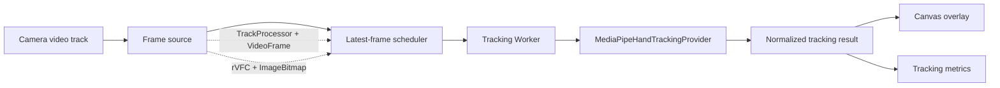

# Phase 1 追跡パイプライン実装プラン

- 作成日: 2026-07-19
- 対象: **合意した次工程2〜4 — HandTrackingProvider / latest-frame-only Worker / 二手カーソル・21点表示**
- ステータス: 実装着手前
- 文書種別: 作業計画。仕様の正本ではない
- 前提成果物: commit `d971b9c`のStep 1.1カメラ診断画面

この文書は、直前に合意した次の3項目を一まとまりとして実装し、その直後にiPhone 15とGoogle Pixel 10 Pro XLで初回実機確認を行うための計画である。

1. `HandTrackingProvider`とMediaPipe Web実装
2. latest-frame-only Workerパイプライン
3. 二手カーソルと21点ランドマーク表示

仕様やゲートを変更する文書ではない。判断が食い違う場合は、[資料ガイド](./README.md)が示す正本、特に[技術戦略・実装計画](./02_technical_strategy_and_plan.md)を優先する。

## 1. 目的

インカメの各フレームから最大二手の21点ランドマークを取得し、同期推論をメインスレッドから隔離した上で、古いフレームをキューへ溜めずに画面へ表示できる状態を作る。

この工程で確認したいことは次の3点である。

- MediaPipe固有のAPIを後続のゲーム／ジェスチャー判定から隔離できる。
- 推論が遅い場合も、処理待ちフレームが増えず、常に新しい入力へ追いつける。
- 鏡像プレビュー上で二手カーソルと21点が正しい位置へ表示され、追跡状態と性能値を説明できる。

ここまで揃った時点で一時HTTPSリンクを発行し、カメラだけでなく二手追跡を含めて両端末を一度に確認する。

## 2. スコープ

### 2.1 実装するもの

- MediaPipeに依存しない追跡結果型と`HandTrackingProvider`インターフェース
- `@mediapipe/tasks-vision`の固定バージョンとHand Landmarker fullモデル
- 同一オリジンから配信するWASM／モデル資産
- `numHands = 2`、`runningMode = "VIDEO"`のMediaPipe実装
- 専用Workerの初期化、推論、結果、破棄、エラーの通信プロトコル
- `MediaStreamTrackProcessor`経路と`requestVideoFrameCallback()`経路の機能検出
- in-flight 1件＋pending最新1件だけを許すlatest-frame-onlyスケジューラ
- フレームとWorkerの時刻、推論時間、破棄数、追跡出力Hzの計測
- Canvas 2Dによる二手カーソル、21点、接続線、左右ラベル
- 一手／両手の追跡喪失表示と、開発用表示切り替え
- 単体テスト、Workerテスト、ブラウザテスト、実画面確認
- 完成直後の一時HTTPSリンクによるiPhone／Pixel実機確認

### 2.2 この工程では実装しないもの

- エアタップ、リボンスワイプ、クラップ等のジェスチャー判定
- Web Audioクロック、beat変換、効果音、採点
- 二手交差を含む本格的な安定ID、速度・加速度、手幅正規化
- 派生ランドマークの永続保存、リプレイ
- 解像度／delegateの自動品質選択
- 90秒MVP、譜面、キャラクター、VFX
- 恒久的なホスティングと独自ドメイン

本格的な安定IDは技術バックログの後続項目である。この工程では、フレーム内の検出結果を安定IDと誤認させない。

## 3. 採用する依存関係と資産方針

### 3.1 MediaPipe

2026-07-19確認時点では次を実装候補として固定する。

| 項目 | 採用値 | 扱い |
|---|---|---|
| npm package | `@mediapipe/tasks-vision@0.10.35` | `package.json`とlockfileへ完全固定 |
| nightly | `1.0.0-rc.20260718` | 採用しない |
| task | Hand Landmarker | Gesture Recognizerは使わない |
| model | HandLandmarker full bundle | 公式配布元から取得し、出典とSHA-256を記録 |
| running mode | `VIDEO` | Worker内で`detectForVideo()`を実行 |
| hands | `2` | 一手へ自動縮退しない |
| initial thresholds | 各`0.5` | 公式既定値から始め、実測前に調整しない |
| delegate | GPUを第一候補、初期化失敗時だけCPUへ一度フォールバック | 実際に使った経路と理由を表示 |

公式Webガイドは`detectForVideo()`が同期処理でUIスレッドをブロックするため、Web Workerでの実行を案内している。本計画でも専用Workerを必須とする。

### 3.2 WASMとモデル

- CDNの`@latest`参照を使わない。
- WASMとモデルはアプリと同一オリジンから配信する。
- WASMは固定済みnpm packageから再現可能なスクリプトで`public`配下へ配置する。
- fullモデルは公式配布元、取得日、ファイルサイズ、SHA-256、ライセンス／Model Card参照を記録する。
- build前に必要資産とハッシュを検証し、不足や不一致を黙ってネットワーク取得せず失敗させる。
- Service Worker、WASM threads、COOP/COEPはこの工程では追加しない。

## 4. アーキテクチャ



境界ルール:

- MediaPipe固有の型はWorker内のprovider実装から外へ出さない。
- UI、描画、後続ジェスチャーは正規化済みのプロジェクト型だけを受け取る。
- カメラプレビューは引き続き`<video>`へ直接表示し、推論用Canvasへ毎フレーム複製しない。
- 描画は`requestAnimationFrame()`、追跡はカメラフレーム駆動とし、互いを待たせない。
- Worker結果の到着順が前後しても、古い`frameId`で新しい表示を上書きしない。

## 5. 追跡データモデル

### 5.1 providerの入力と出力

```ts
type TrackingInput = {
  frameId: number;
  image: VideoFrame | ImageBitmap;
  timestamp: {
    captureTimeMs: number;
    source: "capture-time" | "presentation-time" | "callback-time";
    callbackTimeMs: number;
  };
};

type DetectedHand = {
  detectionIndex: number;
  handedness: "left" | "right" | "unknown";
  handednessScore: number;
  landmarks2D: Array<{ x: number; y: number; zRelative: number }>;
  landmarksWorld: Array<{ x: number; y: number; z: number }>;
};

type HandTrackingFrame = {
  frameId: number;
  captureTimeMs: number;
  callbackTimeMs: number;
  workerReceivedTimeMs: number;
  inferenceStartedTimeMs: number;
  inferenceCompletedTimeMs: number;
  hands: DetectedHand[];
};
```

`detectionIndex`はそのフレーム内だけの番号であり、安定した`trackId`ではない。左右色分けには`handedness`を使えるが、交差時の同一性を保証しない。

### 5.2 信頼度の扱い

MediaPipe WebのHand Landmarker結果から直接得られるのはhandedness分類スコアであり、プロジェクト正本が想定する`trackingConfidence`と同義ではない。

- handednessスコアを`trackingConfidence`へ流用しない。
- この工程のprovider出力では`handednessScore`を独立して保持する。
- 追跡信頼度を必須にする前に、取得可能な信号と算出方法を整理し、必要なら技術正本のデータモデルを更新する。
- 得られない値を`1.0`やhandednessスコアで埋めない。

## 6. Worker通信プロトコル

### 6.1 Main → Worker

| message | 内容 |
|---|---|
| `INIT` | WASM URL、model URL、delegate、`numHands`、thresholds |
| `FRAME` | `frameId`、transferable frame、フレーム時刻 |
| `DISPOSE` | providerのclose、保持フレームのclose、Worker終了 |

### 6.2 Worker → Main

| message | 内容 |
|---|---|
| `READY` | 実際のdelegate、package/model識別子、初期化時間 |
| `RESULT` | 正規化済み`HandTrackingFrame` |
| `FRAME_ERROR` | 対象frameId、分類済みエラー、処理継続可否 |
| `FATAL_ERROR` | 初期化または継続不能エラー |
| `DISPOSED` | 資源解放完了 |

通信型はdiscriminated unionとし、Main／Workerの双方で網羅性を型検査する。エラー文字列だけで分岐しない。

## 7. latest-frame-only設計

### 7.1 不変条件

- Workerで推論中のフレームは最大1件。
- Main側で次に送るpendingフレームは最大1件。
- 新しいフレームが来た時にpendingがあれば、古いpendingを即座に`close()`して置き換える。
- Worker結果を受け取ったら、その時点の最新pendingだけを送る。
- 停止、再初期化、ページ離脱時はin-flight以外の全フレームを閉じ、Workerへ`DISPOSE`する。
- frameを作成した経路にかかわらず、所有者を明確にし、同じframeを二重にcloseしない。

許容する保持数は「処理中1＋次の最新1」であり、配列や無制限queueを作らない。

### 7.2 フレーム取得経路

1. `MediaStreamTrackProcessor`が利用可能なら、`VideoFrame`をtransferする。
2. 非対応環境では`requestVideoFrameCallback()`を基準に`ImageBitmap`を作成してtransferする。
3. どちらも使えない場合は低頻度フォールバックを明示し、通常品質として扱わない。

分岐は機能検出で行い、OS名やユーザーエージェントで決めない。実機確認ではiPhoneとPixelが実際に選んだ経路を記録する。

### 7.3 時刻

- MediaPipeへ渡す時刻はミリ秒で単調増加させる。
- `captureTime`が得られれば使用し、得られない場合は提示／callback時刻と区別する。
- Worker受信時刻、推論開始、推論完了を同じtime originで記録する。
- 音声クロックへの対応は次工程で行い、この工程の時刻をゲーム時刻の正本にしない。

## 8. 二手カーソルと21点表示

### 8.1 Canvasオーバーレイ

- `<video>`の上へ透明Canvasを一枚重ねる。
- device pixel ratioを考慮して内部解像度を設定する。
- `object-fit: cover`による拡大・切り抜きを含む座標変換を一つの関数へ集約する。
- 元ランドマークは変更せず、鏡像は描画変換で一度だけ行う。
- resize、orientation、video設定変更時に変換を再計算する。

### 8.2 表示内容

- 片手につき21点と公式接続関係
- 左右で異なる色。ただし色だけでなく`L`／`R`／`?`を併記
- 手首とMCP群（0、5、9、13、17）の平均による暫定手のひら中心カーソル
- handednessスコア
- 開発用の表示切り替え: preview、landmarks、connections、cursor、labels

手のひら中心は表示用の暫定値であり、後続のジェスチャー用派生特徴量として確定しない。

### 8.3 鏡像と左右

- 画面上の左／右と解剖学的な左手／右手を別概念として扱う。
- MediaPipeのhandednessを無条件に反転しない。
- PC確認時に既知の左手／右手を一方ずつ上げ、プレビュー鏡像、ランドマーク位置、ラベルの対応を記録する。
- 端末または入力経路で結果が異なる場合、表示だけを場当たり的に入れ替えず入力境界の規則を見直す。

### 8.4 追跡喪失

- 片手だけ消えた状態と両手が消えた状態を分離する。
- 追跡喪失をMISSとして表示しない。
- 一時的なちらつきを避けるため、表示用に短い時間ベースの猶予を設ける場合も、推測ランドマークを判定入力には使わない。
- `framing`、`ready`、`one-hand-lost`、`both-hands-lost`、`performance-low`へ接続できる状態イベントを用意する。

## 9. 計測画面へ追加する値

### Worker

- 初期化状態と時間
- 実際のdelegateとフォールバック理由
- frame source
- in-flight数（常に0または1）
- pending数（常に0または1）
- captured / sent / completed / replaced / errored

### 遅延・性能

- callback→Worker受信
- Worker待機時間
- 推論p50 / p95 / max
- 推論完了時frame age p50 / p95
- 追跡出力Hz
- カメラFPS、描画FPSとの比較

### 追跡

- 現在の検出手数
- 手の初回取得時間
- 一手／二手coverage
- 片手ごとの連続欠落時間
- handednessとhandednessスコア

未計測値は`—`または「未対応」と表示し、ゼロとして集計しない。

## 10. 実装順序

### 工程2 — HandTrackingProviderとMediaPipe

- [ ] `@mediapipe/tasks-vision@0.10.35`を固定導入する。
- [ ] 公式fullモデルの出典、ライセンス、SHA-256を記録する。
- [ ] WASM／modelの同一オリジン配信とbuild前検証を作る。
- [ ] provider共通型とライフサイクルを定義する。
- [ ] MediaPipe結果をプロジェクト型へ正規化するadapterを実装する。
- [ ] `numHands = 2`、VIDEO mode、既定thresholdsで初期化する。
- [ ] GPU初期化失敗時のCPUフォールバックと理由コードを実装する。
- [ ] fixtureを使ったadapter単体テストを追加する。

### 工程3 — latest-frame-only Worker

- [ ] Main／Workerの通信型を定義する。
- [ ] Worker内でproviderを初期化、推論、closeする。
- [ ] TrackProcessor経路を`FrameSource`として分離する。
- [ ] rVFC＋ImageBitmap経路を`FrameSource`として分離する。
- [ ] in-flight 1＋pending最新1のスケジューラを実装する。
- [ ] 置換、停止、例外時に全transferableをcloseする。
- [ ] 単調増加timestampとframeIdの順序保護を実装する。
- [ ] Worker／推論／frame ageの計測を追加する。
- [ ] fake frameでqueue非増加、置換、closeを単体テストする。

### 工程4 — 二手カーソルと21点表示

- [ ] Canvas overlayと座標変換を実装する。
- [ ] cover／mirror／DPR／resizeの変換テストを追加する。
- [ ] 21点、接続線、左右ラベル、暫定カーソルを描画する。
- [ ] preview／landmarks／connections／cursor／labelsの切り替えを追加する。
- [ ] 一手／両手喪失状態をUIへ接続する。
- [ ] 追跡メトリクスを診断パネルへ追加する。
- [ ] mock providerで二手表示をブラウザ自動テストする。
- [ ] PC実カメラで鏡像、左右、追従、停止／再開を確認する。
- [ ] 実画面を横長・844×390・縦長で表示して確認する。

### 統合後 — 最初の実機チェックポイント

- [ ] production buildを一時HTTPSリンクで公開する。
- [ ] iPhone 15 / Safariでカメラ、二手、21点、選択経路、計測値を確認する。
- [ ] Pixel 10 Pro XL / Chromeで同じ項目を確認する。
- [ ] 各端末で60秒の通常計測と、開始／停止／再開を確認する。
- [ ] フレーム待ち行列が増えないことをcaptured／replaced／completedで確認する。
- [ ] 結果を記録し、次の一手を一つだけ決める。

## 11. 想定ファイル構成

責務が保たれる限り実装時に名称は調整してよい。

```text
src/
├─ tracking/
│  ├─ hand-tracking-provider.ts
│  ├─ tracking-types.ts
│  ├─ mediapipe-hand-tracking-provider.ts
│  ├─ mediapipe-result-adapter.ts
│  └─ hand-connections.ts
├─ worker/
│  ├─ tracking-worker.ts
│  ├─ tracking-worker-client.ts
│  └─ tracking-worker-messages.ts
├─ camera/
│  ├─ frame-source.ts
│  ├─ track-processor-frame-source.ts
│  ├─ rvfc-frame-source.ts
│  └─ latest-frame-scheduler.ts
├─ rendering/
│  ├─ overlay-renderer.ts
│  ├─ video-coordinate-transform.ts
│  └─ palm-cursor.ts
└─ metrics/
   └─ tracking-metrics.ts

public/
└─ mediapipe/
   ├─ wasm/
   └─ models/
      └─ hand_landmarker.task

scripts/
└─ prepare-mediapipe-assets.mjs

tests/
├─ mediapipe-result-adapter.test.ts
├─ latest-frame-scheduler.test.ts
├─ tracking-worker-messages.test.ts
├─ video-coordinate-transform.test.ts
└─ palm-cursor.test.ts
```

## 12. テスト計画

| レベル | 確認内容 | 合格条件 |
|---|---|---|
| 型／単体 | adapter、通信union、scheduler、percentile、座標変換、cursor | 境界値、欠落、入替、例外を含めて成功 |
| Worker統合 | INIT、FRAME、RESULT、ERROR、DISPOSE | Mainをブロックせず、資源が解放される |
| queue試験 | 推論より速くframeを供給 | in-flight≤1、pending≤1、古いpendingがcloseされる |
| ブラウザ自動 | mock providerで0／1／2手、喪失、表示切替 | 状態と描画が期待どおり |
| MediaPipe smoke | 検証済み静止fixtureまたは実カメラ | 21点×最大2手が正規化型へ変換される |
| PC手動 | 実カメラ、鏡像、左右、停止／再開 | 表示位置が映像と一致し、console errorなし |
| iPhone / Pixel | 一時HTTPSで二手追跡と計測 | 両端末で選択経路と結果を記録できる |

人物画像を自動テストfixtureとして保存する場合は、ライセンスまたは明示同意を確認する。原則として合成データ、公開ライセンス素材、mock resultを優先する。

## 13. 完了条件

次をすべて満たした時点で、この3工程を完了とする。

- [ ] MediaPipe固有の型がprovider境界より下流へ漏れていない。
- [ ] package、WASM、modelが固定され、同一オリジンから再現可能に配信される。
- [ ] 二手・VIDEO modeの推論が専用Worker内で動く。
- [ ] メインスレッドで`detectForVideo()`を呼んでいない。
- [ ] in-flightとpendingが各1件を超えず、長時間でもqueueが増えない。
- [ ] 破棄・置換・停止・例外時に`VideoFrame`／`ImageBitmap`がcloseされる。
- [ ] 21点とカーソルがcover／mirror後の映像位置へ一致する。
- [ ] 左右、未知、一手喪失、両手喪失が色だけでなく文言でも分かる。
- [ ] カメラFPSと追跡出力Hz、推論時間とframe ageを区別して表示できる。
- [ ] lint、型検査、単体テスト、build、ブラウザテストが成功する。
- [ ] PC実カメラの確認が完了する。
- [ ] iPhone 15とPixel 10 Pro XLで初回実機結果を記録できる。
- [ ] 生映像を録画、アップロード、永続保存していない。

実機で一方の経路が動かない場合も、推測でPassにしない。Web固有問題、入力経路問題、MediaPipe初期化問題、性能問題を分け、次に変更するものを一つだけ決める。

## 14. 主なリスクと対策

| リスク | 観測 | 対策 |
|---|---|---|
| Safari WorkerでWASM／GPU初期化失敗 | `FATAL_ERROR`、delegate | CPUへ一度だけフォールバックし理由を記録 |
| ImageBitmap生成自体が重い | callback→Worker受信、frame age | TrackProcessorとの実測比較、解像度比較は後続で実施 |
| frameのclose漏れ | メモリ増加、長時間劣化 | 所有権を型・テストで固定し、全終了経路を検証 |
| 鏡像で点がずれる | 映像とランドマーク不一致 | cover＋mirror変換を純粋関数化してfixtureテスト |
| handednessが見た目と逆 | 既知の手による確認 | 画面側と解剖学的左右を分離し、入力境界で規則化 |
| 二手交差で色が入れ替わる | 交差時の表示 | この工程では既知制約として記録し、安定ID工程で解決 |
| 推論がカメラより遅い | replaced増加、追跡Hz低下 | queueを増やさず最新優先を維持し、端末実測後に品質判断 |

## 15. 次工程へのゲート

この計画が完了するまで、ジェスチャー状態機械とWeb Audio統合へ進まない。

両端末の初回実機確認後、次の一つを選ぶ。

1. **継続**: 二手表示とframe ageが実用的で、時刻付き追跡メトリクスと音声クロックへ進む。
2. **調整**: Webは動くが性能不足で、解像度、delegate、取得経路のうち一つを比較する。
3. **切り分け**: 一方のブラウザだけ失敗し、OS／ブラウザ固有経路を小さく調査する。

この時点ではジェスチャー成功率やP1-Controlledを判定しない。まず二手追跡経路と時刻・性能を観測可能にする。

## 16. 確認した一次資料

確認日: 2026-07-19

- [MediaPipe Hand Landmarker Web guide](https://developers.google.com/edge/mediapipe/solutions/vision/hand_landmarker/web_js) — Web package、`numHands`、VIDEO mode、同期推論とWorker案内
- [MediaPipe Hand Landmarker overview](https://developers.google.com/edge/mediapipe/solutions/vision/hand_landmarker/index) — 出力、full model、既定thresholds、モデル構成
- [@mediapipe/tasks-vision npm package](https://www.npmjs.com/package/@mediapipe/tasks-vision/v/0.10.35) — 固定候補バージョン

公式資料内の`@latest` CDN例は使用せず、検証済みバージョンと同一オリジン資産へ置き換える。
