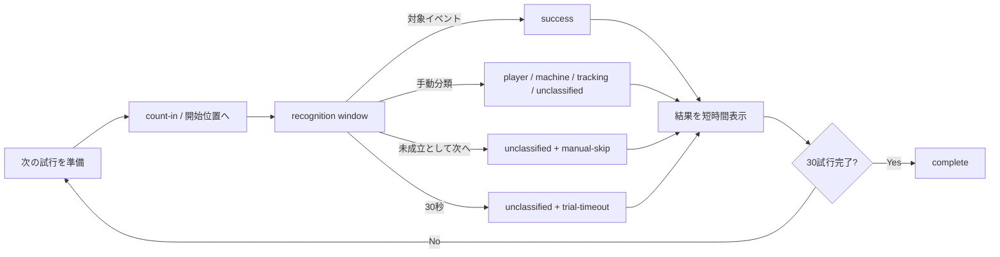

# Phase 1 試行進行・リボンスワイプ信頼性改善 実装計画

- 更新日: 2026-07-20
- 文書種別: Phase 1 / Step 1.1の不具合分析・実装引き継ぎ計画
- ステータス: **実装・自動検証・PC実表示完了、対象実機再試験待ち**
- 対象: P1-Controlledの試行進行、リボンスワイプ状態機械、診断表示、P1 JSON出力
- 非対象: Phase 2 Interaction POC、90秒MVP、演出、ゲーム採点の作り込み

この文書は実装順序と完了条件を記録する補助計画である。POCの分類・合否は[05_poc_test_protocol.md](./05_poc_test_protocol.md)、技術原則は[02_technical_strategy_and_plan.md](./02_technical_strategy_and_plan.md)、画面方針は[04_mvp_uiux_direction.md](./04_mvp_uiux_direction.md)を正本とする。実装時に仕様を確定する場合は、先に該当正本を更新する。

## 1. 実装着手時に行ったこと

1. リポジトリ直下の`AGENTS.md`を読み、commit／push／公開に都度明示承認が必要なことを確認する。
2. [docs/README.md](./README.md)と本書を読む。
3. [05_poc_test_protocol.md](./05_poc_test_protocol.md)の試行進行・分類へ、本書4章の確定方針を反映する。
4. [04_mvp_uiux_direction.md](./04_mvp_uiux_direction.md)へ、タイマー、未成立として次へ、拒否理由表示を反映する。
5. 既存の未コミット変更を`git diff`と`git status`で確認し、`AGENTS.md`の変更を保持したまま実装を始める。
6. 本書11章のテストを先に追加し、現在の失敗を再現してから実装する。

対象実機再試験を別チャットで続ける場合は、次を使える。

> `docs/11_phase1_trial_progression_and_swipe_reliability_plan.md`に従い、Android ChromeとiPhone SafariのP1-Controlled再試験結果を記録してください。条件と閾値はセッション中に変更しないでください。

## 2. 目的・文脈・制約・完了条件

### 2.1 目的

- ジェスチャーが成立しなくてもP1-Controlledの試行が停止し続けないようにする。
- リボンスワイプが実機で成立しにくい構造的原因を修正する。
- 成立しなかった理由を画面とJSONから説明できるようにする。
- 通常の試験結果JSONを、PCへ渡しやすい現実的なサイズにする。

### 2.2 関係する文脈

- P1-Controlledは成功させるためのゲームではなく、認識性能と失敗理由を測る制御試験である。
- `player miss`、`machine miss`、`tracking loss`を機械が根拠なく決めてはならない。
- 未分類を分母から除外して成功率を良く見せてはならない。
- 音声タイムラインとイベント時刻が正本であり、描画フレーム数や`setInterval`回数を時刻の正本にしない。
- latest-frame-onlyを維持し、古いカメラフレームをキューへ溜めない。
- 生映像・生音声は保存しない。

### 2.3 制約

- 最初の修正では、実機データを無視してスワイプ閾値を一括で緩めない。
- 850ms、中心通過、軌跡長、横ずれ等は、状態遷移の不具合を直した後に一項目ずつ評価する。
- Android Chromeだけへ特化せず、iPhone Safariでも同じ試行モデルを使える設計にする。
- 既存P1 schema version 2とlandmark replay schema version 1の読み込み互換を残す。
- 通常のP1結果と詳細診断リプレイを分離しても、PCの実機確認レポートへ集計値を取り込めること。

### 2.4 実装完了条件

- 成功、手動分類、手動スキップ、タイムアウトのいずれでも試行が一度だけ完了する。
- アクティブ試行が30秒を超えて操作不能なまま残らない。
- タイムアウトと手動スキップは10回の分母へ含まれる。
- 右→左と左→右の両方が、鏡像、低追跡Hz、100〜150ms以内の短い欠落を含む合成試験で成立する。
- GO前の準備動作が成功・拒否件数へ混入しない。
- 画面で直近の拒否理由と残り時間を確認できる。
- 通常のP1結果JSONに生映像・音声・全フレームリプレイを含めない。
- 詳細リプレイは明示操作時だけ別ファイルとして保存できる。
- lint、型検査、単体テスト、build、E2E、844×390相当の実表示確認が成功する。

## 3. 実機ログから確認できた事実

### 3.1 解析対象

- ローカルファイル: `test-results/p1-20260720055054080.json`
- `.gitignore`対象であり、GitHubや別PCには自動で引き継がれない。
- 必要な集計値は本章へ転記済みなので、次チャットは元ファイルがなくても実装判断できる。
- schema: `oto-motion-p1-controlled` version 2
- セッション状態: 13 / 30完了、14試行目がアクティブ
- 記録時間: 509,247ms、約8分29秒

### 3.2 ファイルサイズの内訳

| 項目 | 値 |
|---|---:|
| 元ファイル | 28,489,340 bytes |
| インデントを除いた同内容 | 13,997,531 bytes |
| さらに未使用world landmarkを除いた概算 | 7,921,776 bytes |
| 記録フレーム | 4,118 |
| 2D＋world landmark点 | 162,162 |

元ファイルの約51%は整形用空白である。現在のジェスチャー判定とリプレイ再評価は`landmarks2D`を使い、`landmarksWorld`を使っていない。通常結果へ全セッションの全フレームを埋め込む設計は継続しない。

### 3.3 端末・処理性能

| 指標 | 実測値 | 解釈 |
|---|---:|---|
| viewport | 920 × 362 | Android Chrome横画面 |
| camera FPS | 26.86 | カメラ供給自体は約27fps |
| tracking Hz | 8.36 | ジェスチャー追跡には低い |
| inference p50 / p95 | 120.8 / 183.3ms | 高負荷 |
| frame age p95 | 316.6ms | 現行目標140msを大きく超える |
| 1手以上coverage | 76.89% | 約23%は0手 |
| 2手coverage | 20.14% | 二手試験には不足 |
| ID conflict | 54 | 高速移動・欠落時のID不安定要因 |

全4,118フレームの手数は、0手1,003、1手2,369、2手746だった。14試行目相当の最後の約246秒では、2,023フレーム中0手が776、約38%に増えていた。

### 3.4 試行結果

| 試行 | 方向 | 結果 | targetからeventまで |
|---|---|---|---:|
| 1〜10 | air tap | 10成功 | -1.12秒〜+4.55秒 |
| 11 | 左→右 | success | +8.15秒 |
| 12 | 右→左 | success | +13.25秒 |
| 13 | 左→右 | success | +161.48秒 |
| 14 | 右→左 | 未成立 | 最終成功後約245.8秒継続 |

左右両方向のイベント自体は一度以上成立しているため、静的な左右反転だけが主因ではない。イベントが目標時刻から大幅に遅れて偶発的に成立しており、試行ウィンドウと候補状態が同期していない。

### 3.5 拒否理由

リボンスワイプ拒否452件の内訳:

| reason | 件数 | 割合 |
|---|---:|---:|
| `tracking-lost` | 294 | 65.0% |
| `off-axis` | 104 | 23.0% |
| `wrong-direction` | 36 | 8.0% |
| `candidate-timeout` | 18 | 4.0% |

14試行目相当の最終成功後だけで、`tracking-lost` 174、`off-axis` 26、`wrong-direction` 19、`candidate-timeout` 12が発生した。

成功したスワイプでも、GOとなるtargetより前に拒否が発生していた。

| 試行 | target前の拒否 | target後〜成功の拒否 |
|---|---:|---:|
| 左→右1 | 8 | 13 |
| 右→左1 | 2 | 15 |
| 左→右2 | 4 | 179 |

これは現在の機械が「次の試行を開始」を押した直後から動き、音声targetまでの準備・カウント中も拒否を記録している証拠である。

## 4. 確定する試行UXと分類方針

### 4.1 試行ライフサイクル



### 4.2 タイマー

- 定数名の候補: `P1_TRIAL_TIMEOUT_MS = 30_000`。
- 音声targetがある場合、recognition windowの基準は`targetTimeMs`とする。
- 早い動作のoffsetも記録するため、window開始は`targetTimeMs - 500ms`を初期値とする。
- timeout deadlineは`targetTimeMs + 30_000ms`とする。
- 音声targetがない場合、試行開始時刻をwindow開始とし、そこから30秒とする。
- 残り時間は`performance.now()`等の絶対時刻との差から描画し、interval回数を正本にしない。
- 成功、手動分類、手動スキップ、新セッション、disposeで必ずtimerを解除する。
- ページ非表示中に複数試行を自動消化しない。非表示中に期限を超えた場合は、復帰時に現在の1試行だけをtimeout解決し、次の試行開始は画面が表示されてから行う。

### 4.3 timeoutとskipの分類

- timeoutを自動で`player-miss`または`machine-miss`にしない。
- timeout結果は`outcome: "unclassified"`、reason `trial-timeout`とする。
- 「未成立として次へ」は`outcome: "unclassified"`、reason `manual-skip`とする。
- いずれもcompleted件数へ加算し、ジェスチャー10回の分母へ含める。
- `machine-miss`等を判断できる場合は既存の手動分類を使う。
- UI文言はプレイヤーを罰する「失敗」ではなく、「未成立として次へ」を採用する。

### 4.4 自動進行

- timeoutまたは手動スキップ後、約1秒の結果表示を挟んで次の試行を準備する。
- 次試行のカウント音は新たに予約し、前試行のtargetを再利用しない。
- 最終30試行目では次試行を作らず、completeへ移る。
- 自動進行中もユーザーが新セッションを開始した場合は旧timerを破棄する。

## 5. リボンスワイプ状態機械の変更設計

### 5.1 現在の問題

現行`RibbonSwipeStateMachine`は、方向射影が開始側閾値へ入った瞬間にcandidateを作り、その時点から850msを計る。手を開始位置へ置いてカウントを待つだけでtimeoutが進む。また、1フレームでも手が見えないとcandidateを即時削除するため、追跡8Hz環境では高速移動中に候補を維持しにくい。

### 5.2 手ごとの状態

candidateを次の状態へ分ける。

| 状態 | 意味 | timeout |
|---|---|---|
| `seeking-start` | 開始側かつ許容軸内を探す | なし |
| `armed` | 開始位置へ到達し、動作開始待ち | なし |
| `traversing` | 指定方向へ離れ始め、中心通過を追跡中 | 850ms |
| `gap` | 短い追跡欠落中。直前状態を保持 | 150ms |

### 5.3 状態遷移

1. `seeking-start`
   - `projection <= -minimumDistance / 2`かつ軸内で`armed`へ入る。
   - 軸外や中央にいるだけでは拒否を増やさない。
2. `armed`
   - 開始位置で静止してもcandidate timeoutを進めない。
   - 指定方向への射影増加が観測された時点で`traversing`へ入る。
   - 低Hzで開始側から中央近くまで一度に進んだ場合も、直前のarmed sampleから補間して開始する。
   - 明確に逆方向へ離れた場合は`wrong-direction`を1回記録して`seeking-start`へ戻す。
3. `traversing`
   - 850msはこの状態へ入った時点から計る。
   - 中心通過時刻を前後サンプルから補間する。
   - 終了側閾値と中心通過を満たしたらeventを出す。
   - `off-axis`、`wrong-direction`、`candidate-timeout`は理由を一度記録し、再準備可能な状態へ戻す。
4. `gap`
   - 最後に同じtrackIdを見てから150ms以内は候補を保持する。
   - 同じtrackIdが戻れば直前状態へ復帰する。
   - 150msを超えた時点で`tracking-lost`を一度だけ記録して削除する。

### 5.4 count-inとの分離

- 状態機械へ`preparing`と`active`のphaseを渡すか、engine側で結果の採用期間を制御する。
- `preparing`中は開始位置の観測とarmingだけを許し、eventとrejectionを試行結果へ加えない。
- `active`はtargetの500ms前から開始する。
- targetより大幅に前の準備動作を成功として採用しない。
- targetより500ms以内の早い成立はnegative offsetとして保存できる。

### 5.5 最初の修正で維持する値

- `minimumDistance: 0.28`
- `perpendicularTolerance: 0.18`
- `maximumDurationMs: 850`
- 中心`0.5`

まず開始時刻とgap処理を修正し、上記数値は同時に変更しない。修正後の実機ログで`off-axis`が依然支配的なら、画角、ガイド、許容幅のいずれか一項目を次のセッションで変更する。

## 6. 診断表示

### 6.1 常時表示する情報

スマートフォン横画面のP1操作欄へ、次を追加する。

- 状態: `準備中`、`GO`、`判定中`、`未成立を記録`、`完了`
- 残り時間: 秒、小数不要
- 直近の拒否理由: 日本語1行
- 「未成立として次へ」ボタン

### 6.2 拒否理由の日本語

| reason | 表示例 |
|---|---|
| `tracking-lost` | 手を一時的に追跡できませんでした |
| `off-axis` | ガイドの帯から外れました |
| `wrong-direction` | 指定と逆方向へ動きました |
| `candidate-timeout` | スワイプの移動時間が上限を超えました |
| `trial-timeout` | 30秒で未成立として記録しました |
| `manual-skip` | 未成立として次へ進みました |

- 同一理由を毎フレーム更新せず、発生時刻と件数を保持する。
- Developer telemetryを常時展開する必要はない。
- `PERFORMANCE LOW`時は「追跡出力が低いためジェスチャーが途切れる可能性があります」をP1欄にも短く表示する。

## 7. データモデルとschema

### 7.1 P1 trial result

`P1TrialResult`へ、最低限次を追加する。

```ts
interface P1TrialTiming {
  readonly preparedAtMs: number;
  readonly windowOpenedAtMs: number;
  readonly targetTimeMs: number | null;
  readonly deadlineTimeMs: number;
  readonly finishedAtMs: number;
}

type P1Resolution =
  | "gesture-event"
  | "manual-classification"
  | "manual-skip"
  | "trial-timeout";
```

各結果には`timing`、`resolution`、既存`outcome`、`reasonCodes`、`event`、`offsetMs`を保存する。`manual-skip`と`trial-timeout`はoutcomeではなく解決経路であり、outcomeは`unclassified`のままとする。

### 7.2 試行ごとの診断

グローバルなrejectionsだけでは試行との対応が困難なので、次のいずれかでtrialIdを保持する。推奨は後者。

1. `GestureRejection`自体へtrialIdを追加する。
2. engineで`P1TrialDiagnosticRecord`へ包み、ジェスチャー状態機械をP1へ依存させない。

推奨形:

```ts
interface P1TrialDiagnosticRecord {
  readonly trialId: string;
  readonly ordinal: number;
  readonly timeMs: number;
  readonly kind: "rejection" | "tracking-gap" | "identity-conflict";
  readonly handIds: readonly string[];
  readonly reasonCodes: readonly string[];
}
```

### 7.3 P1 session schema version 3

通常結果は次を含む。

- protocolと30試行結果
- summary
- gesture events
- trial diagnosticsまたは試行別集計
- technical summary / snapshot
- privacy宣言
- replayの有無と別ファイル名を示すmetadata

通常結果には全frame配列を埋め込まない。既存version 2のP1 JSONは、実機確認レポートとリプレイ読込で引き続き受け付ける。

## 8. JSONサイズ改善

### 8.1 出力を二つへ分ける

1. **P1結果JSON（通常）**
   - PCへ渡す標準ファイル。
   - 全試行結果、集計、イベント、拒否理由、技術値を含む。
   - replay framesを含めない。
   - 目標サイズは数百KB以下。
2. **診断リプレイJSON（任意）**
   - 「診断リプレイを保存」でのみ出力。
   - 生映像・音声を含まない。
   - active trialと短い前後bufferだけを対象にする。
   - `landmarks2D`だけを保存する新schemaを導入する。

### 8.2 replay recorder

- セッション開始から常時全frameを複製し続けない。
- 試行前500ms程度のring bufferを持つ。
- 試行window開始時にpre-rollを取り込み、解決後500ms程度でそのtrial windowを閉じる。
- trialId、frame index範囲、timing、resolutionを一緒に保存する。
- world landmarksは現行gesture replayで使っていないためversion 2から省く。
- version 1 parserは残し、旧ファイルを読み込めるようにする。
- 最初の実装では浮動小数点の量子化を行わない。精度変更は別の検証単位とする。

### 8.3 serialize

- ユーザー向け標準出力は`JSON.stringify(document)`でcompactにする。
- 開発者が読みやすいpretty JSONは別の明示的debug操作に限定する。
- gzipは有効だが、ブラウザ・PC間の読み込み導線が増えるため初回実装の必須条件にしない。

## 9. 変更対象ファイル

| ファイル | 主な変更 |
|---|---|
| `docs/05_poc_test_protocol.md` | timeout、manual skip、分母、分類の正本化 |
| `docs/04_mvp_uiux_direction.md` | タイマー、未成立ボタン、理由表示 |
| `docs/10_phase1_ai_preparation_implementation.md` | 実装後に実施結果を追記 |
| `src/poc/phase1-protocol.ts` | timing、resolution、期限、一度だけfinishする規則 |
| `src/poc/phase1-lab-engine.ts` | preparing/active、試行別diagnostics、短いgapの受け渡し |
| `src/poc/phase1-lab-controller.ts` | timer、skip、auto advance、visibility、cleanup |
| `src/gestures/ribbon-swipe-state-machine.ts` | seeking/armed/traversing/gap状態 |
| `src/gestures/gesture-types.ts` | 必要なreason code型 |
| `src/poc/phase1-session.ts` | schema v3、replay分離、summary互換 |
| `src/replay/landmark-replay.ts` | schema v2、2Dのみ、trial window、v1互換parser |
| `src/testing/device-checklist.ts` | P1 v2/v3のsummary取込互換 |
| `src/ui/lab-view.ts` | 残り時間、状態、最新理由、skip、別download |
| `src/ui/styles.css` | 横画面で主要操作を1画面へ収める |
| `tests/phase1-protocol.test.ts` | timeout/skip/二重finish防止 |
| `tests/phase1-lab-engine.test.ts` | 鏡像・phase・試行diagnostic |
| `tests/gesture-state-machines.test.ts` | 双方向・低Hz・gap・rearm |
| `tests/landmark-replay.test.ts` | v1互換、v2縮小、trial window |
| `tests/device-checklist.test.ts` | P1 v2/v3取込 |
| `e2e/camera.spec.ts` | timer、skip、auto advance、download、横画面 |

## 10. 実装手順

### Step A — 正本と失敗再現テスト

1. `05`と`04`を更新する。
2. 右→左の状態機械テストを追加する。
3. 3拍カウント相当の開始位置待機後にスワイプするテストを追加する。
4. 8Hz相当と1フレーム欠落のテストを追加し、現行実装で失敗を確認する。
5. protocolの30秒timeoutとmanual skipのテストを追加し、未実装による失敗を確認する。

### Step B — protocol timing

1. active trial timingをsnapshotから取得可能にする。
2. finishを冪等にし、successとtimeoutが同時に入っても結果を一件だけにする。
3. timeout/manual skipのresolutionとreasonを記録する。
4. 最終試行完了状態をテストする。

### Step C — swipe machine

1. candidateを4状態へ分割する。
2. 150ms gapを追加する。
3. preparing/activeを分離する。
4. target前の拒否混入を止める。
5. 双方向、低Hz、gap、off-axis、wrong-direction、timeout、rearmを通す。

### Step D — controllerとUI

1. 残り時間と試行状態を描画する。
2. manual skipを接続する。
3. timeout処理を接続する。
4. 1秒後のauto advanceを接続する。
5. visibility、new session、disposeでtimerを破棄する。
6. 最新理由とperformance warningを表示する。
7. 844×390と920×362で、カメラ開始、試行指示、skip、timerが同時に操作可能か確認する。

### Step E — export分離

1. P1 session schema v3を作る。
2. 標準結果からreplay framesを外す。
3. optional diagnostic replay v2を作る。
4. recorderをtrial window方式へ変更する。
5. v2 P1 / v1 replay import互換をテストする。
6. 標準JSONと診断JSONのサイズをテストへ記録する。

### Step F — 全検証と実機再試験

1. `npm run verify`
2. `npm run test:e2e`
3. PC実表示
4. Android Chrome横画面
5. iPhone Safari横画面
6. 30試行完走、JSON保存、PC取込
7. 本書12章の結果表を更新する。

commit、push、Sitesデプロイは、この実装を依頼した同じチャットでユーザーが明示した場合だけ行う。実装完了だけでは行わない。

## 11. テストマトリクス

### 11.1 RibbonSwipeStateMachine

| Case | 入力 | 期待 |
|---|---|---|
| LTR clean | 0.30→0.48→0.70 | 1 event |
| RTL clean | 0.70→0.52→0.30 | 1 event |
| start hold | 開始位置で1.5秒保持後に移動 | 保持中timeoutなし、移動でevent |
| pre-target | targetより1秒以上前に動く | success/rejectionへ加算しない |
| preparation state | target前にtap／clap／swipeする | cooldown／compressed／traversingをactiveへ持ち越さない |
| boundary interpolation | window前sampleからwindow内frameで中心通過 | eventTimeがwindow外ならevent件数へ加算しない |
| early target | target-300msで成立 | success、negative offset |
| 8Hz | 125ms間隔の3〜5sample | event |
| short gap | traversing中に100〜150ms欠落 | candidate維持 |
| long gap | 150ms超欠落 | tracking-lostを1回 |
| off axis | y許容外へ移動 | off-axisを1回、rearm可能 |
| wrong direction | armed後に逆方向 | wrong-directionを1回 |
| traverse timeout | 動作開始後850ms超 | candidate-timeoutを1回 |
| center jump | 低Hzで中心を跨ぐ | eventTime補間 |
| mirrored engine | raw x減少をpreview x増加へ変換 | 指示と同方向でevent |

### 11.2 Phase1ControlledRunner / controller

| Case | 期待 |
|---|---|
| success before deadline | success一件、timer解除 |
| exact deadline | timeout一件、二重finishなし |
| eventとtimeout競合 | 先に確定した一件だけ |
| manual skip | unclassified + manual-skip、completed増加 |
| manual classification | 選択outcome + manual-classification |
| auto advance | 約1秒後に次trialを準備 |
| trial 30 | complete、追加trialなし |
| new session | 旧timer無効、結果reset |
| dispose | callbackが残らない |
| hidden page | 復帰時に1試行だけ解決、裏で連続消化しない |

### 11.3 Export / import

- P1 v3標準結果にraw camera/audio/replay framesがない。
- privacy宣言がfalse/falseのまま。
- optional replay v2に2D landmarkとtrial windowだけがある。
- P1 v2埋込replayを引き続き読める。
- replay v1を引き続き読める。
- P1 v2とv3のsummaryをPC実機確認フォームへ取り込める。
- compact JSONを保存し、標準結果が数百KB以下である。

### 11.4 E2E

- スマホ横画面で残り時間とskipがviewport内にある。
- skipでprogressが1増え、次trialへ進む。
- fake clockで30秒進めるとtimeoutして次へ進む。
- success後に遅延timeoutが追加されない。
- 30件すべてtimeoutでもcompleteへ到達できる。
- 標準P1 JSONに`manual-skip`/`trial-timeout`が残る。
- optional diagnostic replayを別downloadできる。
- 試行解決直後のdownloadは500ms post-roll確定後に開始する。

## 12. 実機再試験の記録欄

実装後、条件を混ぜず端末ごとに記録する。

### 自動検証・PC実表示

- `npm run verify`: 成功
- `npm run test:e2e`: Chromium 11件成功。skip、自動進行、30件すべてtimeoutでの完走、標準／診断JSON分離を含む
- 合成試験: 左→右／右→左、125ms間隔、150ms以内の欠落、長い開始位置保持、拒否後のrearm、target前非集計、negative offsetに成功
- 844×390実表示: 状態、残り時間、直近理由、skipが同時にviewport内。skip後に1件だけ完了し、約1秒後に次試行へ進行
- ブラウザconsole error: なし
- 対象実機: 未実施。以下の表を埋めるまでP1-ControlledをPassにしない

### Android Chrome

| 項目 | 実装前 | 実装後 |
|---|---:|---:|
| tracking Hz | 8.36 | |
| frame age p95 | 316.6ms | |
| swipe success / 10 | 3成功後に停止 | |
| tracking-lost | 294 | |
| off-axis | 104 | |
| wrong-direction | 36 | |
| candidate-timeout | 18 | |
| trial-timeout | 未実装 | |
| 30試行完走 | No | |
| 標準JSONサイズ | 28.5MB | |
| 診断JSONサイズ | 同一ファイル | |

### iPhone Safari

| 項目 | 値 |
|---|---:|
| tracking Hz | |
| frame age p95 | |
| swipe success / 10 | |
| tracking-lost | |
| off-axis | |
| wrong-direction | |
| candidate-timeout | |
| trial-timeout | |
| 30試行完走 | |
| 標準JSONサイズ | |
| 診断JSONサイズ | |

## 13. 実装後の判断ルール

1. 30試行が止まらず完走し、理由が記録できれば、試行進行の不具合は解消とする。
2. tracking Hzが引き続き15Hz未満またはframe age p95が140ms超なら、ジェスチャー閾値より先にMediaPipe処理負荷、モデル、入力解像度、Worker経路を次の変更候補とする。
3. tracking-lostが大幅に減り、off-axisが支配的になった場合だけ、ガイド幅または`perpendicularTolerance`を一項目変更する。
4. 双方向で偏りが残る場合は、同一の画面座標軌跡をmirror on/offで再生し、方向変換層を検証する。
5. 一つのセッション内で閾値を変更しない。変更後は新しいsessionIdで再試験する。
6. 実装済みであっても、両対象端末のP1-Controlled結果が揃うまでPhase 1 Passにしない。

## 14. 残る未決事項

- 追跡8Hzの主因が端末性能、GPU delegate、float16 full model、入力解像度のどれかは未確定。
- target前windowを500msとする値は初期値であり、正本更新時に確認する。
- auto advanceの結果表示時間を1秒とする値はUX確認で調整可能。
- optional diagnostic replayを将来gzip化するかは、PC取込導線とブラウザ互換を確認して別判断とする。
- world landmarkが将来ジェスチャーで必要になった場合は、通常P1ではなく目的を限定した別計測として戻す。

この未決事項は実装を止めるものではない。初回実装では本書の推奨初期値を使い、実機結果から一項目ずつ見直す。
